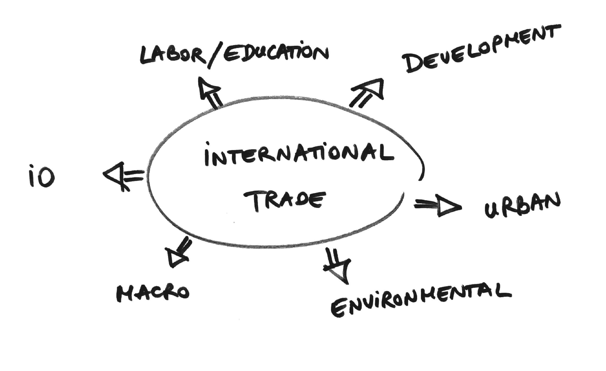

class: inverse, middle

```{r Setup, include = F}
options(htmltools.dir.version = FALSE)
library(pacman)
p_load(ggthemes, viridis, knitr, dslabs, gapminder, extrafont, Ecdat, wooldridge, tidyverse, magrittr)
# Define colors
red_pink <- "#e64173"
met_slate <- "#272822" 
turquoise <- "#20B2AA"
orange <- "#FFA500"
red <- "#fb6107"
blue <- "#2b59c3"
green <- "#8bb174"
grey_light <- "grey70"
grey_mid <- "grey50"
grey_dark <- "grey20"
purple <- "#6A5ACD"
slate <- "#314f4f"
# Notes directory
dir_slides <- "~/Lectures/01-Intro"
# Knitr options
opts_chunk$set(
  comment = "#>",
  fig.align = "center",
  fig.height = 7,
  fig.width = 10.5,
  warning = F,
  message = F
)  
opts_chunk$set(dev = "svg")
options(device = function(file, width, height) {
  svg(tempfile(), width = width, height = height)
})
options(crayon.enabled = F)
options(knitr.table.format = "html")
```

```{css, echo = F, eval = F}
@media print {
  .has-continuation {
    display: block !important;
  }
}
```

# Prologue

---
# Who am I? 

[**Philip Economides**](https://philip-economides.com)

- Currently: PhD Candidate, Economics, Teaching Int. Trade, Int. Econ and Econometrics

- Previously: RA at ESRI/Trinity College Dublin, Ireland

- Focus: International Trade, Transport Economics, Applied Econometrics

--

.hi-pink[Where can you find me?]

- Online Office hours: Tuesday 15:00-16:00, Thursday 10:00-11:00, or by appointment
- Email: [.mono[peconomi@uoregon.edu]](mailto:peconomi@uoregon.edu) **(use EC 380 in the subject line)**

---

layout: true
# Coursework & Grades

---

__See syllabus for full details__

* .hi-slate[W1-W3:] Theory of Trade
* .hi-slate[W4-W7:] Trade Policy
* .hi-slate[W8-W10:] Global Finance

Content will be available on Canvas. If familiar with the platform, see the course [Github](https://github.com/peconomi) page.

--

* 25% - 5 Problem Sets (5pp each)
* 10% - 3 Quizzes (5pp each), best 2
* 25% - Midterm Exam
* 40% - Final Exam

---


layout: true

# Course Objectives

---

We will use two textbooks:

* International Economics, 3rd-5th Ed. by Feenstra & Taylor .hi-pink[(IE)]

* International Economics: Theory & Policy 9th-11th Ed. by Krugman, Melitz, Obstfeld .hi-pink[(IETP)]

--

Lectures are not a substitute for these resources, but rather the finishing touch on solidifying your knowledge. For this class we will:

* study baseline models explaining why countries trade 
* analyze theoretical and empirical applications of these models
* explore global finance through exchange rates and BoP 


---


layout: true

# Course Objectives: Synergies

---

```{r, echo=FALSE, out.width="95%"}



```


---

exclude: true

```{R generate pdfs, include = F, eval = F}
#remotes::install_github('rstudio/pagedown')
library(pagedown)
pagedown::chrome_print("01-Introduction.html", output = "01-Introduction.pdf")
```
