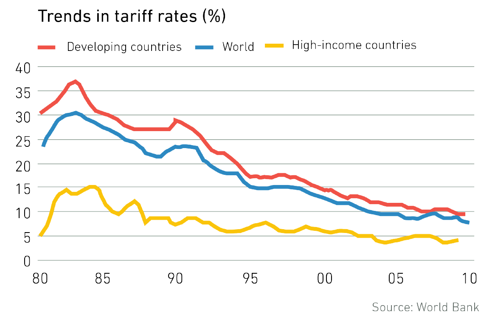

class: inverse, middle

```{r Setup, include = F}

library(pacman)
p_load(ggthemes, viridis, knitr, dslabs, gapminder, extrafont, Ecdat, wooldridge, tidyverse, magrittr)
options(htmltools.dir.version = FALSE)
# Define colors
red_pink <- "#e64173"
met_slate <- "#272822" 
turquoise <- "#20B2AA"
orange <- "#FFA500"
red <- "#fb6107"
blue <- "#2b59c3"
green <- "#8bb174"
grey_light <- "grey70"
grey_mid <- "grey50"
grey_dark <- "grey20"
purple <- "#6A5ACD"
slate <- "#314f4f"
# Notes directory
dir_slides <- "~/Lectures/01-Intro"
# Knitr options
opts_chunk$set(
  comment = "#>",
  fig.align = "center",
  fig.height = 7,
  fig.width = 10.5,
  warning = F,
  message = F
)  
opts_chunk$set(dev = "svg")
options(device = function(file, width, height) {
  svg(tempfile(), width = width, height = height)
})
options(crayon.enabled = F)
options(knitr.table.format = "html")
```

```{css, echo = F, eval = F}
@media print {
  .has-continuation {
    display: block !important;
  }
}
```

# Prologue

---

# Course Objectives

<br>

For this class we will:

--

* study baseline models explaining why countries trade 

--

* analyze policy-relevant trade tools (tariffs, quotas, subsidies)

--

* explore global finance through exchange rates and BoP 


---

# Course Objectives: Synergies

<br>

```{r, echo=FALSE, out.width="95%"}


```

---

# Today's Plan
<br>

1. __Course logistics__

1. About me

1. Key facts about international trade

1. If time allows... overview of key models of trade

---

# Course logistics


We will use .hi-pink[(IE)] while latter text is completely optional:

* International Economics by James Gerber .hi-pink[(IE)] 7th-8th Ed.

* International Economics by Feenstra & Taylor .hi-pink[(IE)] 3rd-5th Ed.

--

Content will be available on Canvas. If familiar with the platform, see the course [Github](https://github.com/peconomi) page.

--

.pull-left[
* .hi-slate[W1-W3:] Theory of Trade
* .hi-slate[W4-W7:] Trade Policy
* .hi-slate[W8-W10:] Global Finance
]

.pull-right[
* 25% - 5 Problem Sets
* 10% - 3 Quizzes, best 2
* 25% - Midterm Exam
* 40% - Final Exam
]

---

# Today's Plan

<br>

1. Course logistics

1. __About me__

1. Key facts about international trade

1. If time allows... overview of key models of trade

---

# About me


[**Philip Economides**](https://philip-economides.com)

- Currently: PhD Candidate, Economics, Teaching Int. Trade, Int. Econ and Econometrics

- Previously: RA at ESRI/Trinity College Dublin, Ireland

- Focus: International Trade, Transport Economics, Applied Econometrics

--

.hi-pink[Where can you find me?]

- Online Office hours: Tuesday 15:00-16:00, Thursday 10:00-11:00, or by appointment
- Email: [.mono[peconomi@uoregon.edu]](mailto:peconomi@uoregon.edu) **(use EC 380 in the subject line)**


---

# Today's Plan

<br>

1. Course logistics

1. About me

1. __Key facts about international trade__

1. If time allows... overview of key models of trade

---

class: inverse, middle

# International Trade:

## Key Facts

---

# Trade growth outpaces GDP growth

```{r, out.width="85%", echo=FALSE}


```

Recent slowdown in trade, which we will address

---

# Flows rising as share of GDP (US)

```{r, out.width="80%", echo=FALSE}


```

---

# Trade varies in importance

```{r, echo=FALSE, out.width="85%"}


```

Small open economies are highly reliant on trade. 

---

# Key Facts I

<br>

* Trade is important and increasingly so
* Flows represent a large portion of US GDP
* Trade openness varies across countries of different sizes

--

Questions arise:

* Why do countries trade so much and why is it growing in scale?
* What are the gains from trade?
* How does trade translate into other changes (e.g. labor market outcomes, geopolitical tensions)

--

.hi-slate[Part I] of this course will focus on the .hi-slate[theories of international trade]. By the time we are done, very generalized lessons will be available to us. 

---

# Introducing Theory

<br>

Main Questions:

* What goods do each country trade?

* How does trade affect product specialization?

---

# What goods do each country trade?

```{r, echo=FALSE}

knitr::include_graphics("figures/4_country_goods.png")

```

---

# Specialization and Compar. Advantage

```{r, echo=FALSE}

knitr::include_graphics("figures/5_product_year.png")

```


---

# Key Facts II


<br>

* Countries specialize and export core products

* Trading the goods that countries are "best" at producing results in _gains from trade_

--

What factors, other than fundamentals, influence specialization?

--

- Foreign direct investment (FDI)?

- Knowledge diffusion?

- Cross-border migration shocks?

---

# Why does trade continue growing?

<br>

Largely attributed to reduced trade barriers over time.

--

We refer to this process as .hi-slate[trade liberalization].

--

Examples include tariff rate reductions, preferential trade agreements and alleviating non-tarif measures (e.g. lower electronics quota for French imports to USA). 

--

__Since trade is not frictionless, do these frictions vary across countries?__


---

# Trade friction index

```{r, echo=FALSE}

knitr::include_graphics("figures/6_trade_index.png")

```

---

# Reduced Tariffs

```{r, echo=FALSE}



```

---

# Lower Transport Costs

```{r, echo=FALSE, out.width="80%"}

knitr::include_graphics("figures/8_freight_rates.png")

```

---

# Key Facts III

<br>

* Explicit trade barriers have fallen over time, coinciding with the growth of trade relative to broad economic acivity

* Hidden barriers are the next hurdle, one which much of the literature suggests is far more impactful than existing tariff rates

--

Current trade theory and literature focuses on .hi-pink[heterogenous agent models], which was originally created to explain why not every firm functions as an exporter.

We __will not__ be going that deep into international trade, though I can recommend some texts for those interested in understanding the most modern forms of theory. 


---

# Overview Trade Theory

<br>

.hi-pink[Why does trade occur?] Two strands within the field of international trade:

--

__I. Neoclassical models of trade__ ('old' theories):

- Ricardian model: Technology differences spur trade

- Heckscher-Ohlin model: Resource differences spur trade

--

__II. 'New' Trade Theory__

- Krugman model: Love of variety spurs trade

- Melitz model: Heterogenous firms drive trade


---

# Next Class

<br>

We will begin looking into international trade theory, starting with the .hi-pink[Ricardo model].

* Single factor of production (labor)

* Two-country model (home, foreign)

* Technology differences across countries 

Going forward, try to describe each model by three attributes, such as those listed above, and the model's main takeaway(s)!

__Readings:__ International Economics, Ch.1: Introduction to the World Economy

---

exclude: true

```{R generate pdfs, include = F, eval = F}
#remotes::install_github('rstudio/pagedown')
library(pagedown)
pagedown::chrome_print("01-intro.html", output = "01-intro.pdf")
```
