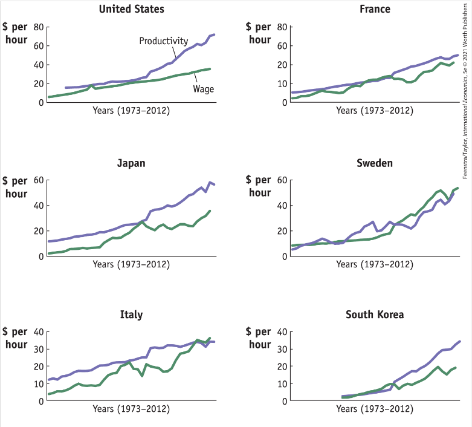

class: inverse, middle

```{r Setup, include = F}
options(htmltools.dir.version = FALSE)
library(pacman)
p_load(ggthemes, viridis, knitr, dslabs, gapminder, extrafont, Ecdat, wooldridge, tidyverse, magrittr, kableExtra)
devtools::install_github("R-CoderDotCom/econocharts")

library(econocharts)
# Define colors
red_pink <- "#e64173"
met_slate <- "#272822" 
turquoise <- "#20B2AA"
orange <- "#FFA500"
red <- "#fb6107"
blue <- "#2b59c3"
green <- "#8bb174"
grey_light <- "grey70"
grey_mid <- "grey50"
grey_dark <- "grey20"
purple <- "#6A5ACD"
slate <- "#314f4f"
# Notes directory
dir_slides <- "~/Lectures/01-Intro"
# Knitr options
opts_chunk$set(
  comment = "#>",
  fig.align = "center",
  fig.height = 7,
  fig.width = 10.5,
  warning = F,
  message = F
)  
opts_chunk$set(dev = "svg")
options(device = function(file, width, height) {
  svg(tempfile(), width = width, height = height)
})
options(crayon.enabled = F)
options(knitr.table.format = "html")
```

```{css, echo = F, eval = F}
@media print {
  .has-continuation {
    display: block !important;
  }
}
```

# Prologue

---

# Recap  

<br>

Examined the .hi-pink[closed economy] setting.

IC of Home's consumers tangent to Home PPF at __(45, 35)__.

IC of Foreign's consumers tangent to Foreign PPF at __(50, 60)__

--

Underlying assumption of .hi-pink[perfectly comptetitive markets] where goods are sold at cost. 

--

Home has .hi-pink[comparative advantage] in producing pies and Foreign has .hi-pink[comparative advantage] in producing potatoes due to .hi-pink[opportunity costs].

---

# Home Equilibrium

```{r, echo=FALSE, out.width="95%", warning=FALSE}

tibble(
    country  = c("Home", "Home"),
    pies     = c(90, 0),
    potatoes  = c(0, 70)
) %>% ggplot() +
    geom_line(aes(x=pies, y=potatoes, color=country), size=2) +
    theme_bw() + 
    scale_y_continuous(expand=c(0,0), limits=c(0,150)) + 
    scale_x_continuous(expand=c(0,0), limits=c(0,150)) +
    coord_fixed() + ggtitle("Production Possibility Frontier, Home") + 
    theme(title = element_text(size=14),
          legend.position = "right",
          legend.title = element_blank(),
          legend.text = element_text(size=16),
          axis.title.x = element_text(size=16),
          axis.title.y = element_text(size=16),
          axis.text.x = element_text(size=14),
          axis.text.y = element_text(size=14))  + 
    geom_function(fun = function(x){180 - 36.8*log(x+6)} , xlim=c(4,140))+
    geom_point(aes(x=45,y=35), size=3) +
    geom_label(aes(x=62,y=42), label="Home No-Trade Equilibrium", size=3, position = position_dodge(0.9),
               vjust = 0)
```

---

# Foreign Equilibrium

```{r, echo=FALSE, out.width="95%", warning=FALSE}

tibble(
    country  = c(
        "Foreign", "Foreign"),
    pies     = c(100, 0),
    potatoes  = c(0, 120)
) %>% ggplot() +
    geom_line(aes(x=pies, y=potatoes, color=country), size=2) +
    theme_bw() + 
    scale_y_continuous(expand=c(0,0), limits=c(0,150)) + 
    scale_x_continuous(expand=c(0,0), limits=c(0,150)) +
    coord_fixed() + ggtitle("Production Possibility Frontier, Foreign") + 
    theme(title = element_text(size=14),
          legend.position = "right",
          legend.title = element_blank(),
          legend.text = element_text(size=16),
          axis.title.x = element_text(size=16),
          axis.title.y = element_text(size=16),
          axis.text.x = element_text(size=14),
          axis.text.y = element_text(size=14))  + 
    # geom_function(fun = function(x){180 - 37*log(x+20)}, xlim=c(5,105))+
    #    geom_function(fun = function(x){180 - 35.5*log(x+12)} , xlim=c(4,140))+
    geom_function(fun = function(x){180 - 34.5*log(x-17)} , xlim=c(5,145))+
    geom_point(aes(x=50,y=60), size=3) +
    geom_label(aes(x=52,y=67), label="Foreign No-Trade Equilibrium", size=3, position = position_dodge(0.9),
               vjust = 0)

```


---

# Today's Plans

Currently, we have kept both countries closed off. 

These countries only consume the bundle of goods that they produce. 

--

From autarky scenario $\implies$ free trade. How will .hi-pink[equilibrium outcomes] change?

* What will they produce?

* How much will they consume?

* Do prices change?

* Who benefits from trade under our assumptions?


---

# Free Trade

<br>

--

Country’s no-trade relative price $\implies$ products it will export/import when trade is opened.

--

The pattern of exports and imports determined by .hi-pink[opportunity cost] of production in each country, which identifies each country’s pattern of .hi-pink[comparative advantage]. 

---

# Free Trade Equilibrium

<br>

--

Since .hi-pink[relative price] of pies is $\frac{7}{9}$ at Home but $\frac{12}{10}$ in Foreign, incentive to export Home's pies to Foreign for higher return.

--

Alternatively, the relative price of potatoes is:

$$\tilde P^H_{\text{potato}} = \frac{P^H_{\text{potato}}}{P^H_{\text{pie}}} = \frac{9}{7} > \frac{10}{12}= \frac{P^F_{\text{potato}}}{P^F_{\text{pie}}}=\tilde P^F_{\text{potato}}$$
--

Since potatoes sell better in Home, Foreign producers are incentivized to export to Home.

--

Ricardo Model predicts .hi-pink[Home exports pies] and .hi-pink[Foreign exports potatoes].

---

# Free Trade Equilibrium

--

As Home pies exports $\uparrow$, the local supply $\downarrow$ (more scarce).

--

Greater Home scarcity $\implies$ higher pie price at Home.

--

Lower Foreign scarcity $\implies$ lower pie price at Foreign. 

--

Similarly, Foreign exports of potatoes to Home bid price down abroad and up locally. 

--

Changes to exports and imports stop once the relative price of pies is the same in the two countries.

--

No incentive to deviate from this point $\implies$ equilibrium condition met. 

---

# Free Trade Equilibrium

What would the new .hi-pink[world price] of pies look like for Home in this setting?

--

Measure world capacity to produce potatoes and pies as how much we can produce of either if we put both countries entire workforces towards a single good. 

--

${\bar Q}^W_{\text{pie}} = MPL^H_{\text{pie}}*\bar L + MPL^F_{\text{pie}}*\bar L = 70 + 120 = 190$

--

${\bar Q}^W_{\text{potato}} = MPL^H_{\text{potato}}*\bar L + MPL^F_{\text{potato}}*\bar L = 90 + 100 = 190$

--

Since .hi-pink[world PPF's] slope is line between these two "max" production points, and that __slope is -1__, this implies the __world price would be 1__. 

--

The .hi-pink[free-trade price] of pies 1 is greater than the .hi-pink[autarky price] of $\frac{7}{9}$.

---

# Free Trade Equilibrum

--

<br>

.hi-pink[World price] greater than .hi-pink[opportunity cost] of producing pies at Home.

--

Home producers shift labor to producing more pies. 

--

How much labor will get shifted?


---

# Free Trade Wages

<br>

Wages at Home

$W^H_{\text{pie}} = MPL^H_{\text{pie}}*P^H_{\text{pie}}$ and 
$W^H_{\text{potato}} = MPL^H_{\text{potato}}*P^H_{\text{potato}}$

--

Recall that under trade $\frac{P^H_{\text{pie}}}{P^H_{\text{potato}}}=1$, $MPL^H_{\text{pie}}=9$ and $MPL^H_{\text{potato}}=7$.

--

Wage Ratio:  $\frac{P^H_{\text{pie}}*MPL^H_{\text{pie}}}{P^H_{\text{potato}}*MPL^H_{\text{potato}}}= 1 * \frac{9}{7} = \frac{9}{7}$.

Implies wages are higher working in pies than in potatoes.

.hi-pink[All Home workers go work in the pie industry].


---

# Free Trade Equilibrium: Home

```{r, echo=FALSE, out.width="95%", warning=FALSE}

tibble(
    country  = c("Home Pre-Trade", "Home Pre-Trade",
                 "Home Trade", "Home Trade"),
    pies     = c(90, 0, 90, 5),
    potatoes  = c(0, 70, 0, 85)
) %>% ggplot() +
    geom_line(aes(x=pies, y=potatoes, color=country), size=2) +
    theme_bw() + 
    scale_y_continuous(expand=c(0,0), limits=c(0,150)) + 
    scale_x_continuous(expand=c(0,0), limits=c(0,150)) +
    coord_fixed() + ggtitle("Production Possibility Frontier, Home") + 
    theme(title = element_text(size=14),
          legend.position = "right",
          legend.title = element_blank(),
          legend.text = element_text(size=16),
          axis.title.x = element_text(size=16),
          axis.title.y = element_text(size=16),
          axis.text.x = element_text(size=14),
          axis.text.y = element_text(size=14))  + 
    geom_function(fun = function(x){180 - 36.8*log(x+6)} , xlim=c(4,140))+ 
    geom_function(fun = function(x){180 - 35.7*log(x-2)} , xlim=c(4,140))+
    geom_point(aes(x=45,y=35), size=3) +
    geom_point(aes(x=90,y=0), size=3) +
    geom_point(aes(x=45,y=45), size=3) +
    geom_segment(aes(x=0, xend=45, y=45, yend=45), linetype="dashed")+
    geom_segment(aes(x=45, xend=45, y=0, yend=45), linetype="dashed")+
    geom_label(aes(x=20,y=38), label="Pre-Trade Eq", size=4, position = position_dodge(0.9),
               vjust = 0) + 
    geom_label(aes(x=105, y=5), label="Trade Eq: Production", size=4, position = position_dodge(0.9),
               vjust = 0) +
    geom_label(aes(x=65, y=48), label="Trade Eq: Consumption", size=4, position = position_dodge(0.9),
               vjust = 0)

```

---

# Free Trade Equilibrium: Home

<br>

Home produces 90 pies and 0 potatoes, yet we see it is consuming 45 of each.

--

This implies 45 pies are exported to foreign and in return, 45 potatoes imported from Foreign. 

--

.hi-pink[How does the relative price change affect Foreign?]


---

# Free Trade Equilibrium: Foreign

```{r, echo=FALSE, out.width="95%", warning=FALSE}
tibble(
    country  = c(
        "Foreign Pre-Trade", "Foreign Pre-Trade",
        "Foreign Trade", "Foreign Trade"),
    pies     = c(100, 0,  115, 0 ),
    potatoes  = c(0, 120, 5, 120)
) %>% ggplot() +
    geom_line(aes(x=pies, y=potatoes, color=country), size=2) +
    theme_bw() + 
    scale_y_continuous(expand=c(0,0), limits=c(0,150)) + 
    scale_x_continuous(expand=c(0,0), limits=c(0,150)) +
    coord_fixed() + ggtitle("Production Possibility Frontier, Foreign") + 
    theme(title = element_text(size=14),
          legend.position = "right",
          legend.title = element_blank(),
          legend.text = element_text(size=16),
          axis.title.x = element_text(size=16),
          axis.title.y = element_text(size=16),
          axis.text.x = element_text(size=14),
          axis.text.y = element_text(size=14))  + 
    # geom_function(fun = function(x){180 - 37*log(x+20)}, xlim=c(5,105))+
    #    geom_function(fun = function(x){180 - 35.5*log(x+12)} , xlim=c(4,140))+
    geom_function(fun = function(x){180 - 34.5*log(x-17)} , xlim=c(5,145))+
    geom_function(fun = function(x){180 - 33.9*log(x-26)} , xlim=c(5,145))+
    geom_point(aes(x=50,y=60), size=3) +
    geom_point(aes(x=60,y=60), size=3) +
    geom_point(aes(x=0, y=120), size=3)  +
    geom_segment(aes(x=0, xend=60, y=60, yend=60), linetype="dashed")+
    geom_segment(aes(x=60, xend=60, y=0, yend=60), linetype="dashed")+
    geom_label(aes(x=38,y=55), label="Pre-Trade Eq", size=3, position = position_dodge(0.9),
               vjust = 0)+
    geom_label(aes(x=18,y=123), label="Trade Eq: Production", size=3, position = position_dodge(0.9),
               vjust = 0)+
    geom_label(aes(x=75,y=62), label="Trade Eq: Consumption", size=3, position = position_dodge(0.9),
               vjust = 0)
```


---

# Free Trade Outcome

.pull-left[
```{r, echo=FALSE}

prod_set = tibble( Country = c("Home", "Foreign"),
        Pie=  c("90", "0"),
        Potato = c("0", "120"))


prod_set %>% kbl(caption ="Trade Eq. - Production Bundles") %>% kable_styling()
```
]


.pull-right[
```{r, echo=FALSE}

con_set = tibble( Country = c("Home", "Foreign"),
        Pie=  c("45", "60"),
        Potato = c("45", "60"))


con_set %>% kbl(caption ="Trade Eq. - Consump. Bundles") %>% kable_styling()
```
]

--

<br>

The introduction of trade is .hi-pink[welfare enhancing] for both countries.

--

This is evident from both countries consumption equilibria shifting to a higher indifference curves. 

--

.hi-pink[Difference between consumption and production due to trade].

---

# Free Trade: Wages

<br>

So far we have learnt that there are .hi-pink[gains from trade] and .hi-pink[trade flows are determined by comparative advantage].

--

While prices converged, wages do not. 

--

Wage levels differ across countries with trade, and wages are determined by absolute advantage, not comparative advantage. 

--

This is a third, less-emphasized lesson from the Ricardian model.

---

# Free Trade: Wages


Due to markets being perfectly competitive, firms pay workers the value they add to production (marginal product). 

--

Recall $MPL^H_{\text{pie}}=9$. This is a real wage, measured in quantity of goods rather than money. 

--

Workers sell the pies they earn for the world market price of 1, making their real wage $\frac{P_{\text{pie}}}{P_{\text{potato}}}*MPL^H_{\text{pie}} = 9$ units of potatoes.

--

Since we have a one-for-one price, the units of potatoes and pies they earn are of equal value on the global market. 

--

Foreign real wages rise to 12. .hi-pink[Foreign workers earn more as a result of maintaining absolute advantage over Home]

---

# Absolute Advantage

<br>


Determines wages. Foreign workers earn more as a result of having superior technology. 

--

How do we identify that again? MPL is higher for both goods in one country.

--

In contrast trade flows are determined by .hi-pink[comparative advantage].

--

The underlying implication for this finding is that as countries invest in techonological development, real wages rise. 


---

# Empirical Evidence

<br>

.pull-left[This finding of MPL and real wages co-moving is well supported by surronding research. At a glance, real wage rises with labor productvitiy.]

.pull-right[
```{r, echo=FALSE}

```
]

---

# To Recap

* Countries with no absolute advantage in production can still trade!

* Some advantages are simply driven by technological differences according to this rather dated theory

--

* Since then, the .hi-pink[internet] and subsequent .hi-pink[information age] have largely narrowed differences in technology

--

* .hi-pink[What else helps us understand what drives our need to trade goods?]

--

### Next Class


.hi-slate[Hechscher-Ohlin Model] suggests differences in factor endowments can explain trade patterns


---

exclude: true

```{R generate pdfs, include = F, eval = F}
#remotes::install_github('rstudio/pagedown')
library(pagedown)
pagedown::chrome_print("03-ricardian.html", output = "03-ricardian.pdf")
```
