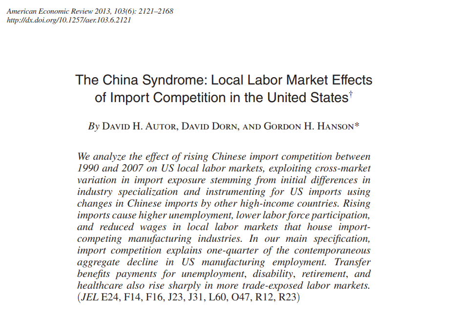
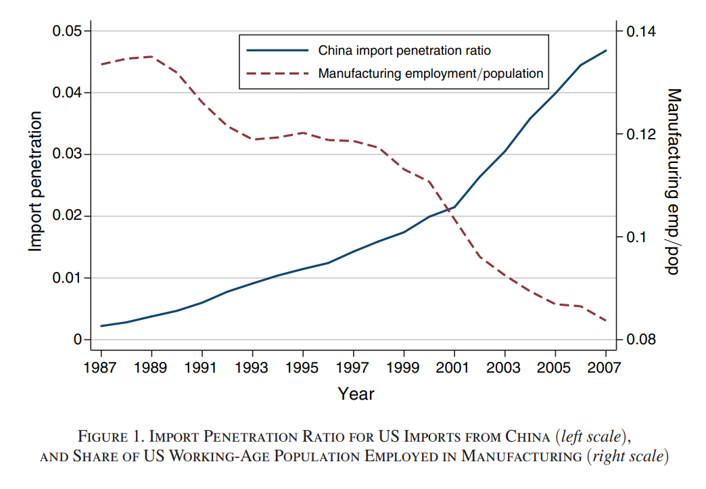
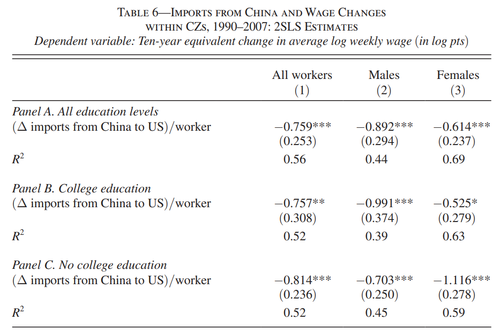
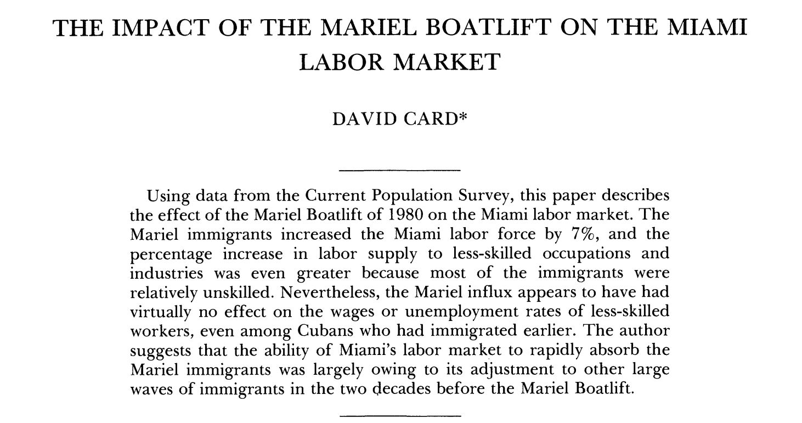
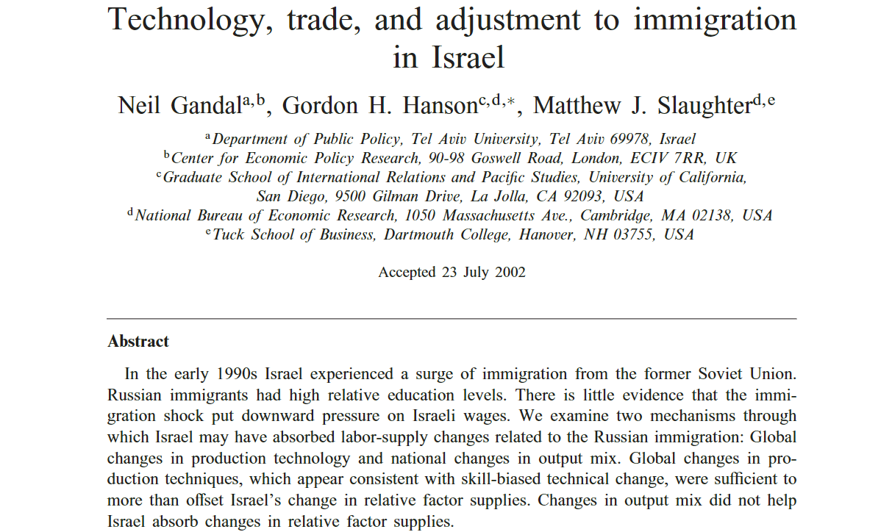

class: inverse, middle

```{r Setup, include = F}
options(htmltools.dir.version = FALSE)
library(pacman)
p_load(ggthemes, viridis, knitr, dslabs, gapminder, extrafont, Ecdat, wooldridge, tidyverse, magrittr, kableExtra, ggtext)
# Define colors
red_pink <- "#e64173"
met_slate <- "#272822" 
turquoise <- "#20B2AA"
orange <- "#FFA500"
red <- "#fb6107"
blue <- "#2b59c3"
green <- "#8bb174"
grey_light <- "grey70"
grey_mid <- "grey50"
grey_dark <- "grey20"
purple <- "#6A5ACD"
slate <- "#314f4f"
# Notes directory
dir_slides <- "~/Lectures/01-Intro"
# Knitr options
opts_chunk$set(
  comment = "#>",
  fig.align = "center",
  fig.height = 7,
  fig.width = 10.5,
  warning = F,
  message = F
)  
opts_chunk$set(dev = "svg")
options(device = function(file, width, height) {
  svg(tempfile(), width = width, height = height)
})
options(crayon.enabled = F)
options(knitr.table.format = "html")
```

```{css, echo = F, eval = F}
@media print {
  .has-continuation {
    display: block !important;
  }
}
```

# Prologue

---

# Recap

So far we've done the majority of the heavy lifting on .hi-pink[trade theory].

--

* Comparative advantages determine trade flows

--

* Differences in technology, factor endowments, location and prosperity can all help countries focus on the final and intermediate goods they specialize in providing

--

* Recent technological advances have fragmented production processes across countries, furthering the importance of trade

--

### Today

Discuss issues of trade wrt jobs, wages and migration

---

# Economic Trends

<br>

--

Manufacturing on .hi-pink[long downward trend] in NA and West EU for decades.

--

Wage inequality increased, particularly in the US with a primary effect on young, low education and less skilled workers.

--

Throughout this period, trade saw its greatest bout of liberalization due to 

* widespread tariff reductions, 
* ascensions of major economies such as China to the World Trade Organization and,
* reductions in trade costs (tech advancement)

---

# Economic Trends

<br>

--

Long trends of declining manufacturing employment and wage reductions.

--

Questions arise with respect to where these jobs are going and are low wages abroad influencing wage levels in developed economies.

--

.hi-pink[Number of jobs] depends on age profile, size of population, labor market policies and the state of the business cycle.

--

While trade does not act as the main influence of .hi-pink[jobs level] for large open economies, it might affect specific sectors in particular focused manner. 

---

# Trade & Jobs


```{r, echo=FALSE, out.width="95%"}



```

---

```{r, echo=FALSE, out.width="95%"}



```

---

```{r, echo=FALSE, out.width="70%"}



```

Largest wage losses for low educated individuals and males. 


---

To quote the authors concluding remarks.. 

> Theory suggests that trade with China yields aggregate gains for the US economy.
Our study also highlights the distributional consequences of trade and the mediumrun efficiency losses associated with adjustment to trade shocks. The consequences
of China trade for US employment, household income, and government benefit programs may contribute to public ambivalence toward globalization and specific anxiety about increasing trade with China.

--

Trade research has increasingly attempted to incorporate considerations for marginalized groups resulting from globalization.

---

# Trade & Jobs


<br>

--

Trade with less developed countries has potenitally led to spillover effects on local wage rates.

--

Up until recently, decline in low-income wage rates was only somewhat attributed to increased trade openness.

--

It was instead initially suggested that tech improvements were driving the marginal productivity of skilled labor upwards, driving up the wage gap.

--

Since 2000, this gap has stagnated, leaving experts without a main explanatory factor anymore (tech change).

---

# Trade & Jobs

<br>

Research in this area has seen a resurgence given that previously accepted thought on the matter has become outdated.

--

A natural question arising in these discussions is whether trade or technology plays a larger role in the sector’s outcomes. 

--

I find that question to be overly broad. 

--

It may also distract needed attention away from research into how to facilitate .hi-pink[reallocation among displaced manufacturing workers].

---

# Trade & Jobs

<br>

--

Manufacturing firms that adopt specific technologies, such as computers or industrial robots, are significantly different from those that do not.

--

They are larger and more productive upon adoption. 

--

While exposure to greater import competition is associated with employment decline, firms increasing their use of imported goods conditional on such exposure can exhibit employment gains.

--

Should direct use of imported goods be considered a technology?

--

.hi-pink[All of these factors suggest further research needs to be multifaceted in terms of how firms respond to increased competition through trade.]


---

# Trade & Jobs

<br>

--

.hi-pink[Does International Trade Reduce Poverty and Income Inequality?]

--

* In 2013, China had 13.9% of world skilled labor and 39.8% of world's less skilled labor 

--

* For the same year, China maintained 16% of world GDP

--

* Scarce in high-skilled labor, abundant in low-skilled

--

* Trade openness translates to elevated demand for low-skill workers, wages rise

---

# Trade & Jobs

<br>

--

.hi-pink[Economist, "Towards the End of Poverty"]

--

* The number of people living off of $1.25 per day was cut by one-half over the past 20 years

--

* Declined from 43% of world pop in 1990 to 21% in 2010

--

* Attributes much of this achievement to China

--

> China is responsible for three-quarters of the achievement ... even though income equality is rising fast, extreme poverty is disappearing. China pulled 680m people out of misery in 1981-2010 and reduced its extreme poverty from 84% to 10%. 


---

# Trade & Jobs

<br>

--

While global poverty has fallen due to free trade, what about income inequality?

--

Income inequality has beeen increasing, such that higher incomes are rising more rapidly than lower incomes. 

--

Same is true of the US $\implies$ relative wages of skilled workers rising in both countries.

--

.hi-pink[This at first at seems counter-intuitive relative to HO model prediction.] A model of offshoring better explains this phenomenon. Will crop up in EC 480. 


---

# Migration

<br>

--

So far our models have kept labor supplies fixed across countries and not allowed for the migration of labor between countries.

--

Workers were able to switch sectors in .hi-pink[Ricardian], .hi-pink[HO] and .hi-pink[specfic factors] models but not country.

--

To incorporate this feature into a model may make it more realistic. 

--

.hi-pink[Both goods and labor can flow between countries, depending on the opportunity costs associated engaging in the wider market]

---

# Migration
--

Causes of migration:

--

* __Push factors__ such as local purchasing power being too low, housing being too expensive, recessions, political strife, war and famine

--

* Climate change and related agricultural patterns may induce further mass migrations in the coming future

--

* __Pull factors__ such as income levels, healthcare, cultural alignment, socioeconomic stability and educational support may draw individuals into a country

--

* __Social networks__ across countries may be another factor to consider. Familial ties, local affinities with particular parts of countries may act as great entry zones for future life in a country

---


# Migration

<br>

--

.hi-pink[In theory], suppose we were in a scenario where trade was already open and now we wanted to allow for the free movement of labor.

--

The European Union is a great example of this process.

--

These changes drive further wage alignment between countries, but will not narrow the gap completely. 

--

Brexit placed a great deal of focus on .hi-pink[limiting the movement of people while trying to keep the movement of goods open].

---

# Migration

--

.hi-pink[In practice], empirics have shown evidence of effects of low-skilled worker inflows __not impacting__ other local worker groups. 

--

```{r, echo=FALSE, out.width="95%"}



```


---

# Migration

.hi-pink[In practice], high-skilled migrant influxes show a similar lack of impact. 

--

```{r, echo=FALSE, out.width="95%"}



```

---

# Migration: Short Run

For movement of $L$ from Foreign to Home, do wages respond?

--

Recall the .hi-pink[Specific Factors model], where labor can move between industries but capital and land are fixed. $\bar{L} = L_M + L_A$

--

```{r, test_output , echo=FALSE, out.width="65%", warning=FALSE, message=FALSE}

 ggplot() +
    geom_function(fun = function(x){20 + 2.2*x} , xlim=c(0,100), color="#0070a4", size=2)+
    geom_function(fun = function(x){200 - 2.2*x} , xlim=c(0,100), color="#0070a4", size=2) +
    geom_vline(xintercept = 0) +
    geom_vline(xintercept = 100) +
    geom_hline(yintercept = 0)+
    geom_segment(aes(x=0, xend=(180/4.4), y=110, yend=110), linetype="dashed", color="black")+
    geom_segment(aes(x=(180/4.4), xend=(180/4.4), y=0, yend=110), linetype="dashed", color="black")+
  geom_point(aes(x=(180/4.4), y=110), size=4)+
  # Custom the Y scales:
  scale_y_continuous(
    # Features of the first axis
    name = "Wages, W",
    expand = c(0,0),
    limits = c(0,NA),
    # Add a second axis and specify its features
    sec.axis = sec_axis( trans=~.*1, name="")
  ) + theme_classic() + xlab("Labor in the Economy") + 
  scale_x_continuous(expand=c(0,0)) +
  theme(axis.text.x = element_blank(),
        axis.text.y = element_blank(),
        axis.title.x = element_text(size=20),
        axis.title.y = element_text(size=20)) +
    geom_label(aes(x=(180/4.4),y=5), label="L", size=12, position = position_dodge(0.9),
               vjust = 0, size=10)+
    geom_label(aes(x=77,y=202), size=6, label="P*MPL (A)", size=12,
               position = position_dodge(0.9), vjust = 0)+
    geom_label(aes(x=75,y=50), size=6, label="P*MPL (M)", size=12,
               position = position_dodge(0.9), vjust = 0)+
  geom_richtext(aes(x=20,
                 y=10,
               label=paste("L<sub>A</sub>"), hjust=1), size=12)+
  geom_richtext(aes(x=77,
                 y=10,
               label=paste("L<sub>M</sub>"), hjust=1), size=12)


```

---

# Migration: Short Run


```{r, test_output_II , echo=FALSE, out.width="65%", warning=FALSE, message=FALSE}

 ggplot() +
    geom_function(fun = function(x){20 + 2.2*x} , xlim=c(20,120), color="#0070a4", size=2)+
    geom_function(fun = function(x){200 - 2.2*x} , xlim=c(20,90), color="#0070a4", size=2) +
    geom_function(fun = function(x){-50 + 2.2*x} , xlim=c(40,120), color="red", size=2) +
    geom_vline(xintercept = 0) +
    geom_vline(xintercept = 100) +
    geom_hline(yintercept = 0)+
    geom_segment(aes(x=0, xend=(180/4.4), y=110, yend=110), linetype="dashed", color="black")+
    geom_segment(aes(x=(180/4.4), xend=(180/4.4), y=0, yend=110), linetype="dashed", color="black")+
  geom_point(aes(x=(180/4.4), y=110), size=4)+
  # New equilibrium
    geom_segment(aes(x=0, xend=(250/4.4), y=75, yend=75), linetype="dashed", color="black")+
    geom_segment(aes(x=(250/4.4), xend=(250/4.4), y=0, yend=75), linetype="dashed", color="black")+
  geom_point(aes(x=(250/4.4), y=75), size=4)+
  # Custom the Y scales:
  scale_y_continuous(
    # Features of the first axis
    name = "Wages, W",
    expand = c(0,0),
    limits = c(0,300),
    # Add a second axis and specify its features
    sec.axis = sec_axis( trans=~.*1, name="")
  ) + theme_classic() + xlab("Labor in the Economy") + 
  scale_x_continuous(expand=c(0,0), limits=c(0,150)) +
  theme(axis.text.x = element_blank(),
        axis.text.y = element_blank(),
        axis.title.x = element_text(size=20),
        axis.title.y = element_text(size=20)) +
    geom_label(aes(x=(180/4.4),y=5), label="L", size=12, position = position_dodge(0.9),
               vjust = 0, size=10)+
    geom_label(aes(x=(250/4.4),y=5), label="L\'", size=12, position = position_dodge(0.9),
               vjust = 0, size=10)+
    geom_label(aes(x=5,y=110), label="W", size=10, position = position_dodge(0.9),
               vjust = 0, size=10)+
    geom_label(aes(x=5,y=75), label="W\'", size=10, position = position_dodge(0.9),
               vjust = 0, size=10)+
    geom_label(aes(x=77,y=202), size=6, label="P*MPL (A)", size=12,
               position = position_dodge(0.9), vjust = 0)+
    geom_label(aes(x=75,y=50), size=6, label="P*MPL (M)", size=12,
               position = position_dodge(0.9), vjust = 0)+
    geom_label(aes(x=125,y=202), size=6, label="P*MPL\' (A)", size=12,
               position = position_dodge(0.9), vjust = 0)+
  geom_richtext(aes(x=20,
                 y=10,
               label=paste("L<sub>A</sub>\'"), hjust=1), size=12)+
  geom_richtext(aes(x=115,
                 y=10,
               label=paste("L<sub>M</sub>\'"), hjust=1), size=12)


```

--

Immigration causes total labor to change: $\bar{L}' = \bar{L} + \Delta L$.

--

Shifting out origin point of $M$ causes the corresponding marginal productivity curve to shift right by $\Delta L$. 


---

# Migration: Short Run

<br>


Equilibrium outcomes

* Number of workers in both industries rises

* Wages across both industries falls for labor

* Why? less scarce than previous, relative to fixed amount of capital (specific factors model assumption)

* What assumption is this based on? .hi-pink[Diminishing marginal productivity of labor]

---

# Migration: Long Run

--

Assume capital and labor move freely between countries, keep land fixed

--

* Given a rise in $\bar{L}$ to $\bar{L}'$ $\implies$ capital/labor readjustment

--

* Instead of SR model, adjusts such that capital-labor ratios ideal for production in each industry are maintained

--

* $\Delta L$ flows entirely into the labor-intensive industry

--

* Both K and L rise for labor-intensive industry, and fall for capital-intensive industry while maintaining fixed capital to labor industry specific ratios

--

* Since ratio between capital and labor is unchanged in both industries, relative scarceness untouched and marginal products remain fixed

---

### To summarise:

* Trade openness appears to have had an affect on the compositional make-up of US industrial activity

--

* Effects are likely negative for .hi-pink[low income unskilled workers]

--

* Migration openness yields little evidence of wage change

--
### Next time

* Effects of protectionism through .hi-pink[tariff rates and quotas]

--

* Inform ourselves on how interference with free trade impacts market


---

exclude: true

```{R generate pdfs, include = F, eval = F}
#remotes::install_github('rstudio/pagedown')
library(pagedown)
pagedown::chrome_print("06-empirics-trade.html", output = "06-empirics-trade.pdf")
```
