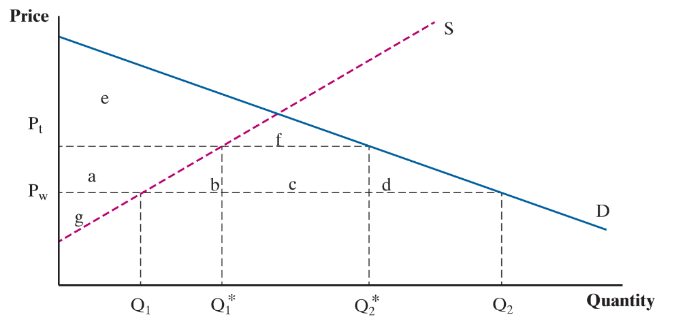
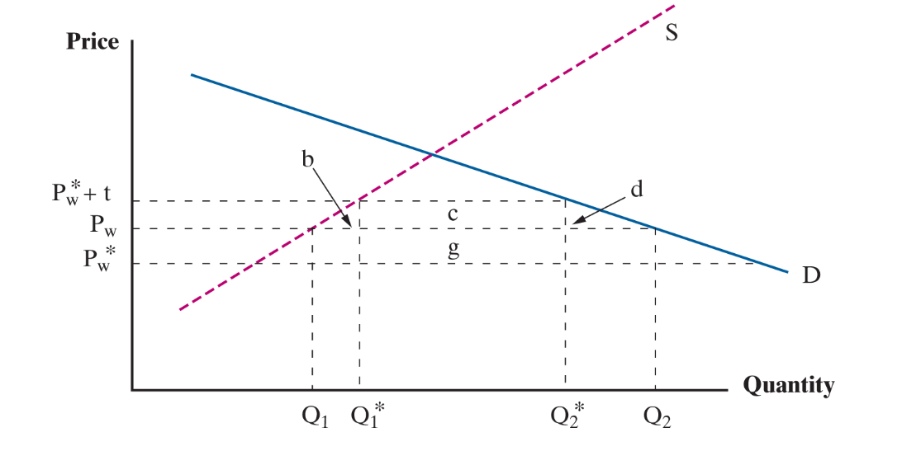

class: inverse, middle

```{r Setup, include = F}
options(htmltools.dir.version = FALSE)
library(pacman)
p_load(ggthemes, viridis, knitr, dslabs, gapminder, extrafont, Ecdat, wooldridge, tidyverse, magrittr, kableExtra, ggtext)

# Define colors
red_pink <- "#e64173"
met_slate <- "#272822" 
turquoise <- "#20B2AA"
orange <- "#FFA500"
red <- "#fb6107"
blue <- "#2b59c3"
green <- "#8bb174"
grey_light <- "grey70"
grey_mid <- "grey50"
grey_dark <- "grey20"
purple <- "#6A5ACD"
slate <- "#314f4f"
# Notes directory
dir_slides <- "~/Lectures/01-Intro"
# Knitr options
opts_chunk$set(
  comment = "#>",
  fig.align = "center",
  fig.height = 7,
  fig.width = 10.5,
  warning = F,
  message = F
)  
opts_chunk$set(dev = "svg")
options(device = function(file, width, height) {
  svg(tempfile(), width = width, height = height)
})
options(crayon.enabled = F)
options(knitr.table.format = "html")
```

```{css, echo = F}
@media print {
  .has-continuation {
    display: block !important;
  }
}


.pull-lefter {
  float: left;
  width: 67%;
}
.pull-rightish {
  float: right;
  width: 25%;
}

.pull-rightish ~ p {
  clear: both;
}

```

# Prologue

---

# Recap

### Previously

* Trade openness appears to have had an affect on the compositional make-up of US industrial activity

--

* Effects are likely negative for .hi-pink[low income unskilled workers]

--

* Migration openness yields little evidence of wage change

--

### Today

* Effects of protectionism through .hi-pink[tariff rates and quotas]

--

* Inform ourselves on how interference with free trade impacts market

---

# Key Topics

<br>

We'll work through .hi-pink[five topics], as per IE:

--

* Use market theory to explain .hi-pink[effects of tariffs] on market outcomes 

--

* Compare tariff data on inputs and outputs to compare .hi-pink[effective and nominal protection] levels

--

* Comparing the .hi-pink[impact of quotas] relative to tariff rate adjustments

--

* Highlight forms of protection .hi-pink[difficult to observe]

--

* New .hi-pink[unconventional methods] of protectionism


---

# Glossary

--

Below I define key terms for this session:

--

* .hi-pink[Protectionism]: A concerted effort to shield domestic indutries from external competitive pressure by restricting foreign import choices. This can be achieved through subsidizing local industry, taxing imports and limiting number of goods that can enter the country, per annum. 

--

* .hi-pink[Tariff]: Percentage of value based tax on a country's imports. These vary based on the origin and commodity of imported goods. 

--

* .hi-pink[Quota]: Weight and quantity limits on the amount of goods that can be imported into the country

--

Not all quotas are acts of protectionism. Some are required for national security (e.g. protecting the domestic supply of food), or to avoid health concerns related to imports from specific countries (e.g. livestock diseases)

---

# Tariffs Analysis

--

<br> 

Thus far we have examined transitions from .hi-pink[autarky] into .hi-pink[free trade].

--

In practice, even the most seemingly open economies will have some kind of measures in place that regulate the manner in which goods are traded internationally. 

--

Restrictions introduce quality control over goods entering Home, but have added effect of .hi-pink[limiting volume of trade] that would otherwise occur. 

--

Why? Trade policy, like any other form of intervention, introduces .hi-pink[costs for firms], which get passed on to consumers. Some will .hi-pink[switch to domestic goods].  

---

# Tariffs Analysis

### Consumer Demand Curve

<br>

--

* Demand is mapped by the marginal willingness of individuals to pay for a good at a given price

* At a particularly high price, only a small number of individuals would purchase

* .hi-pink[As price falls], the good enters into a greater pool of individuals' marginal willingness to pay, leading to .hi-pink[quantity demanded rising]

Therefore, we assume a .hi-pink[negative relationship] between market price and quantity demanded

---
# Tariffs Analysis

### Producer Supply Curve

<br>

--

* When the market price is particularly low, only a small number of firms can afford to service the market

--

* As .hi-pink[price rises], the .hi-pink[quantity supplied to the market increases], given that the greater associated revenue makes business profitable for an increasing number of firms.


--

Therefore, we assume a .hi-pink[positive relationship] between market price and quantity supplied


---

# Tariffs Analysis

### Consumer and Producer Surplus

--

<br>

Combining these two strands of intuition:

--

* Demand curve for a given good is .hi-pink[downward sloping]

--

* Supply curve for a given good is .hi-pink[upward sloping]

--

As per standard econ: market produces where supply meets demand.

Any difference between marginal willingness to pay and price represents surplus for the consumer. Similarly the case for producers. 

---


# Tariffs Analysis

### Consumer and Producer Surplus

--

```{r, echo=FALSE, out.width="90%"}
supply <- function(q){ 20  + 2.2*q}
demand <- function(q){ 160 - 2.2*q}

x=0:100

chart <- ggplot() +
  geom_function(aes(color = "Demand"), fun = demand, xlim=c(0,70), color="#0070a4", size=2) +
  geom_function(aes(color = "Supply"), fun = supply, xlim=c(0,70), color="#0070a4", size=2) +
  ggtitle("Goods Market Equilibrium")

q <- uniroot(function(x) demand(x) - supply(x), range(x))$root
p <- supply(q)

chart <- chart + annotate("point", x = q, y = p, color = "grey30", size=5) + annotate("segment", x = q, xend = q, y = 0, yend = p,
           linetype = "dashed", color = "grey30") +
  annotate("segment", x = 0, xend = q, y = p, yend = p,
           linetype = "dashed", color = "grey30")  + ylab("Price") + xlab("Quantity") +
  scale_y_continuous(expand=c(0,0), limits=c(0,NA), breaks = p, labels = "p*") +
  scale_x_continuous(expand=c(0,0), limits=c(0,NA), breaks = q, labels = "q*") + theme_bw()


chart = chart + theme(axis.text.x = element_text(size=16),
              axis.text.y = element_text(size=16), 
              axis.title.x = element_text(size=20),
              axis.title.y = element_text(size=20),
              title = element_text(size=20))

chart

```

---

# Tariff Analysis

### Consumer and Producer Surplus

```{r, echo=FALSE, out.width="90%"}

z <- seq(0, q, 0.01)

chart <- chart + 
  geom_ribbon(aes(x = z, ymin = supply(z), ymax = p,
                  fill = "Producer surplus"), alpha = 0.25) +
  geom_ribbon(aes(x = z, ymin = p, ymax = demand(z),
                  fill = "Consumer surplus"), alpha = 0.25)

chart + theme(legend.title=element_blank(),
              legend.position = "bottom",
              legend.text = element_text(size=16)) 

```


---

# Tariff Analysis

### Consumer and Producer Surplus

--

To calculate the area of .hi-pink[consumer surplus]:

$$\text{CS} = \frac{1}{2} \times \left[ \ \text{Demand}(q=0) - \ p^{*} \  \right] \times q^*$$

--

To calculate the area of .hi-pink[producer surplus]:

$$\text{PS} = \frac{1}{2} \times \left[ \ p^*-\text{Supply}(q=0) \ \right] \times q^*$$

--

We are simply calculating the areas of the triangles for our measures of CS and PS in this free-market scenario. 

---


# Tariff Analysis

### Consumer and Producer Surplus

<br>

* Useful for discussing implications of .hi-pink[tariffs] and .hi-pink[quotas]

--

* CS and PS determined by market prices and quantities

--

.hi-pink[How do tariffs influece P and Q?]

--

* Our demand and supply curves will reflect national production capacitys

--

* Equilibrium price is determined by world price

---


# Tariff Analysis

--


.pull-lefter[
```{r, echo=FALSE, out.width="95%"}
supply <- function(q){ 20  + 2.2*q}
demand <- function(q){ 160 - 2.2*q}

x=0:100

chart <- ggplot() +
  geom_function(aes(color = "Demand"), fun = demand, xlim=c(0,70), color="#0070a4", size=2) +
  geom_function(aes(color = "Supply"), fun = supply, xlim=c(0,70), color="#851010", size=2) +
  ggtitle("Goods Market Equilibrium with Trade")

q <- uniroot(function(x) demand(x) - supply(x), range(x))$root
p <- supply(q)

chart <- chart + 
  # annotate("point", x = q, y = p, color = "grey30", size=5) + 
  # annotate("segment", x = q, xend = q, y = 0, yend = p,
  #          linetype = "dashed", color = "grey30") +
  # annotate("segment", x = 0, xend = q, y = p, yend = p,
  #          linetype = "dashed", color = "grey30")  + 
  ylab("Price") + xlab("Quantity") +
  scale_y_continuous(expand=c(0,0), limits=c(0,NA), 
                     breaks = c(60, p), labels =c("p[w]", "p*")) +
  scale_x_continuous(expand=c(0,0), limits=c(0,NA), 
                     breaks = c(40/2.2, 100/2.2), labels = c("Q[1]", "Q[2]")) + theme_bw()


chart + 
  #geom_hline(yintercept=60) +
  geom_segment(aes(x=0, xend=(40/2.2), y=60, yend=60), 
               linetype="dashed", color="black") +
  geom_segment(aes(x=(40/2.2), xend=(40/2.2), y=0, yend=60), 
               linetype="dashed", color="black") +
  geom_segment(aes(x=0, xend=(100/2.2), y=60, yend=60), 
               linetype="dashed", color="black") +
  geom_segment(aes(x=(100/2.2), xend=(100/2.2), y=0, yend=60), 
               linetype="dashed", color="black") + 
        theme(axis.text.x = element_text(size=16),
              axis.text.y = element_text(size=16), 
              axis.title.x = element_text(size=20),
              axis.title.y = element_text(size=20),
              title = element_text(size=20))

```
]

.pull-rightish[

$p_w < p^*$ 

Local supply $Q_1$ below market demand $Q_2$

Import amount is $Q_2 - Q_1$

Tariff will upset this balance

]

* Market experiences a huge increase in $CS$ due to trade, $PS$ falls, but net welfare rises ( $CS+PS$ )

* Assume small country, scale of demand cannot affect .hi-pink[world price]

---

# Tariff Analysis

--

Government imposes tariff amount $t$, per good imported

--

Price updates to $P_t= P_w + t$, all of our outcome variables are affected

--

```{r, echo=FALSE, out.width="75%"}
supply <- function(q){ 20  + 2.2*q}
demand <- function(q){ 160 - 2.2*q}

x=0:100

chart <- ggplot() +
  geom_function(aes(color = "Demand"), fun = demand, xlim=c(0,70), color="#0070a4", size=2) +
  geom_function(aes(color = "Supply"), fun = supply, xlim=c(0,70), color="#851010", size=2) +
  ggtitle("Goods Market Equilibrium with Tariffed Imports")

q <- uniroot(function(x) demand(x) - supply(x), range(x))$root
p <- supply(q)

chart <- chart + 
  # annotate("point", x = q, y = p, color = "grey30", size=5) + 
  # annotate("segment", x = q, xend = q, y = 0, yend = p,
  #          linetype = "dashed", color = "grey30") +
  # annotate("segment", x = 0, xend = q, y = p, yend = p,
  #          linetype = "dashed", color = "grey30")  + 
  ylab("Price") + xlab("Quantity") +
  scale_y_continuous(expand=c(0,0), limits=c(0,NA), 
                     breaks = c(60, 70 , p), labels =c("p[w]", "p[t]" , "p*")) +
  scale_x_continuous(expand=c(0,0), limits=c(0,NA), 
                     breaks = c(40/2.2, 50/2.2, 100/2.2, 90/2.2), 
                     labels = c("Q[1]", "Q[1]*", "Q[2]", "Q[2]*")) + theme_bw()


chart + 
  #geom_hline(yintercept=60) +
  geom_segment(aes(x=0, xend=(40/2.2), y=60, yend=60), 
               linetype="dashed", color="black") +
  geom_segment(aes(x=(40/2.2), xend=(40/2.2), y=0, yend=60), 
               linetype="dashed", color="black") +
  geom_segment(aes(x=0, xend=(100/2.2), y=60, yend=60), 
               linetype="dashed", color="black") +
  geom_segment(aes(x=(100/2.2), xend=(100/2.2), y=0, yend=60), 
               linetype="dashed", color="black") +
  geom_segment(aes(x=0, xend=(50/2.2), y=70, yend=70), 
               linetype="dashed", color="#851010") +
  geom_segment(aes(x=(50/2.2), xend=(50/2.2), y=0, yend=70), 
               linetype="dashed", color="#851010") +
  geom_segment(aes(x=0, xend=(90/2.2), y=70, yend=70), 
               linetype="dashed", color="#851010") +
  geom_segment(aes(x=(90/2.2), xend=(90/2.2), y=0, yend=70), 
               linetype="dashed", color="#851010") +
        theme(axis.text.x = element_text(size=15),
              axis.text.y = element_text(size=15), 
              axis.title.x = element_text(size=20),
              axis.title.y = element_text(size=20),
              title = element_text(size=20))

```

---

# Tariff Analysis

```{r, echo=FALSE}

```

--

$CS$ under .hi-pink[free trade], where $t=0: \ \ a+b+c+d+e+f$

---


# Tariff Analysis


```{r, echo=FALSE}

```


$CS$ under .hi-pink[tariff], where $t=10: \ \ e+f$

--

$\Delta CS = - (a+b+c+d)$ 

---

# Tariff Analysis


```{r, echo=FALSE}

```


$PS$ under .hi-pink[free trade], where $t=0: \ \ g$

---


# Tariff Analysis


```{r, echo=FALSE}

```


$PS$ under .hi-pink[tariff], where $t=10: \ \ g +a$

--

$\Delta PS = a$ transferred from consumers to producers

---


# Tariff Analysis


```{r, echo=FALSE}

```


Government collects revenue $t$ times the number of imports

--

$c = t \times [Q_2^* - Q_1^*]$ transferred from consumers to govt

---

# Tariff Analysis


```{r, echo=FALSE}

```


Consumers lost $a+b+c+d$, other parties gained $a$ & $c$<br>
.hi-pink[Societal net loss] of $b+d$ where $d$ is .hi-pink[deadweight loss] and b is .hi-pink[efficiency loss]


---

# Tariff Analysis


.hi-pink[Deadweight loss]

> Loss associated with the economic welfare consumers that otherwise would have purchased in this market would have generated, had there been no government interference.

--

$d = \frac{1}{2}\Delta P \times \Delta Q_2$, where $Q_2$ represents quantity demanded


--


.hi-pink[Efficiency loss]

> Loss associated with producing additional goods at an excessive cost, relatively to how much it would have cost the rest of the world to generate these goods. 

--

$b = \frac{1}{2}\Delta P \times \Delta Q_1$, where $Q_1$ represents quantity supplied


---

# Tariff Analysis

--

<br>

These equilibria we consider do not take into account:

--

* Retaliatory tariffs (e.g. China Trade War)

--

* Innovation and productivity (less competition)

--

* Import/Export interdependencies within country

--

* Rent seeking behaviour (lobbying)

---

# Tariff Analysis: Large Country

--

<br>

Possible to improve national welfare with tariff as long as no retaliation

--

* Tariff adjustment triggers price reduction by exporter country (rest of world)

--

* Fall in Home country demand lowers $P_w$ to $P_w^*$. Home price becomes $P_t^* = P_w^* + t$

--

* Price reduction offsets some of the deadweight loss caused by tariff introduction


---

# Tariff Analysis: Large Country

```{r, echo=FALSE}

```

--

What happens to overall economic welfare following tariff introduction?

---


# Tariff Analysis: Large Country

```{r, echo=FALSE}

```


Lower price implies areas $b$ and $d$ are smaller and domestic production grows by a lower scale.
If $g > b + d$ then tariff was .hi-pink[welfare enhancing].

---

# Key Topics

<br>

* Use market theory to explain effects of tariffs on market outcomes


* __Compare tariff data on inputs and outputs to compare effective and nominal protection levels__


* Comparing the .hi-pink[impact of quotas] relative to tariff rate adjustments


* Highlight forms of protection .hi-pink[difficult to observe]


* New .hi-pink[unconventional methods] of protectionism


---

# Inputs & Outputs

<br>

--

While tariffs protect one industry, they may also inconvenience other domestic industries reliant on imported inputs of intermediate goods


* US tariffs on steel products protected steel industry and hurt car industry

--

.hi-pink[Nominal rate of protection]: The amount of a tariff expressed as a percentage of a good's price. This is the tariff we have discussed so far.

--

.hi-pink[Effective rate of protection]: Level of protection on intermediate inputs and nominal tariff levied on protected good. Measured as percentage change in domestic value added after tariffs on intermediate and final goods applied. 

---

# Inputs & Outputs


.hi-pink[Value-added]: Contribution of domestic production factors (capital and labor) to a given product/good. 

--

$$\text{Effective Rate of Protecton} = (VA^* - VA)/VA$$

--

* $VA$ is domestic value-added under free trade

* $VA^*$ is $VA$ after accounting for all relevant tariffs


---

# Inputs & Outputs

--

Suppose we introduce .hi-pink[two tariffs] in sequence

```{r, echo=FALSE}

tibble(Variable =  c("Domestic Price of Good, VA*", "Value of Imported Input", 
                     "Domestic Value-Added, VA", "Effective RP, %"),
       `No Tariff` =  c(5000, 400, 4600, 0), 
       `40% Tariff, Final Good` =  c(7000, 400, 6600, 43.5),
       `+10% Tariff, Intrm. Good` = c(7000, 440, 6560, 42.6) ) %>% kbl() %>%
  kable_styling()


```

---

# Inputs & Outputs

--

<br>

Sufficiently high import reliance can make tariff protection yield .hi-pink[negative protection measure], depending on the good examined. 

--

.hi-pink[Upcoming homework expects you to yield examples of such outcomes.]


---


### To summarise:

* Tariffs are bad for countries with little influence on world prices

* Large countries exhibit an ambiguous effect

* Tariff protection can backfire, depending on input reliances

--

### Next time

Discuss quotas, difficulties in observing protectionism and unconventional methods used


---

exclude: true

```{R generate pdfs, include = F, eval = F}
#remotes::install_github('rstudio/pagedown')
library(pagedown)
pagedown::chrome_print("07-tariff-quota.html", output = "07-tariff-quota.pdf")
```
