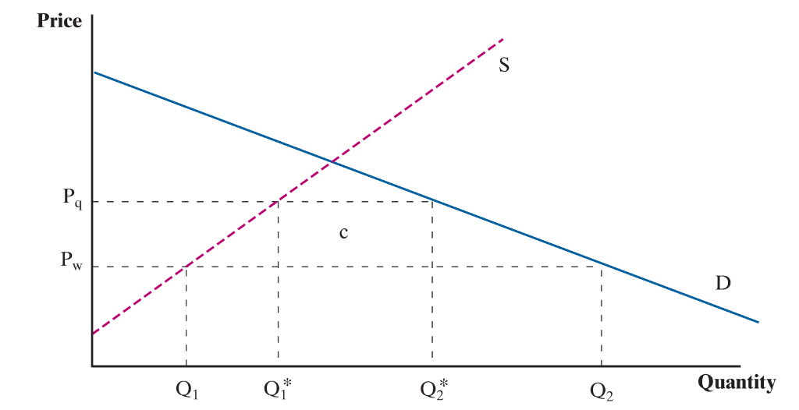
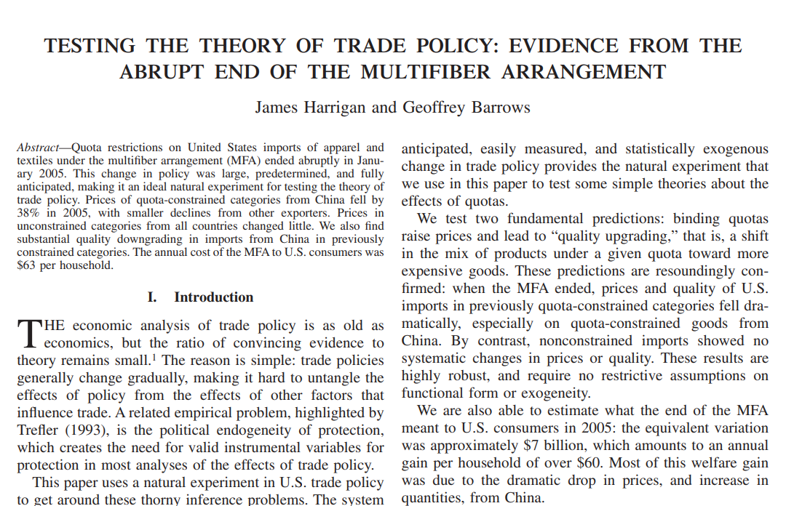
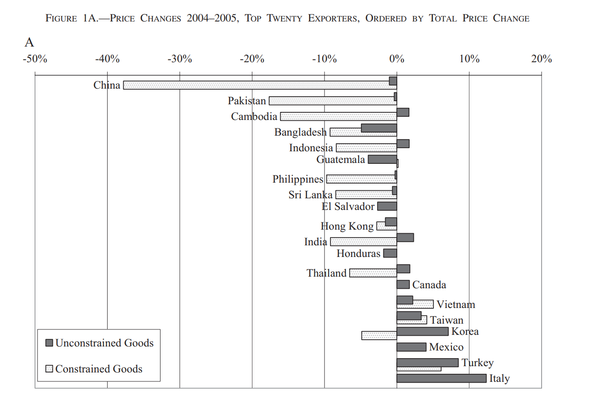
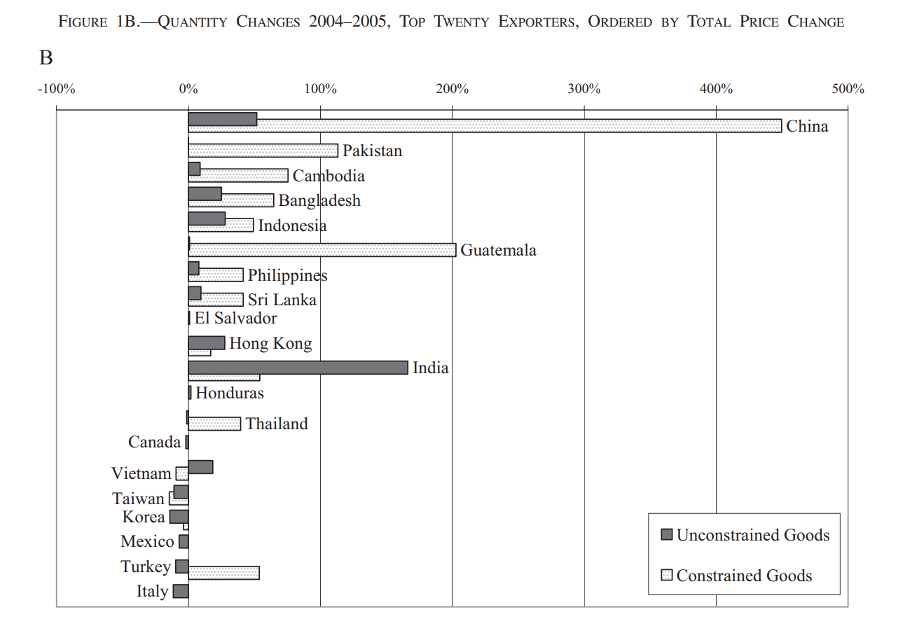

class: inverse, middle

```{r Setup, include = F}
options(htmltools.dir.version = FALSE)
library(pacman)
p_load(ggthemes, viridis, knitr, dslabs, gapminder, extrafont, Ecdat, wooldridge, tidyverse, magrittr, kableExtra, ggtext)


# Define colors
red_pink <- "#e64173"
met_slate <- "#272822" 
turquoise <- "#20B2AA"
orange <- "#FFA500"
red <- "#fb6107"
blue <- "#2b59c3"
green <- "#8bb174"
grey_light <- "grey70"
grey_mid <- "grey50"
grey_dark <- "grey20"
purple <- "#6A5ACD"
slate <- "#314f4f"
# Notes directory
dir_slides <- "~/Lectures/01-Intro"
# Knitr options
opts_chunk$set(
  comment = "#>",
  fig.align = "center",
  fig.height = 7,
  fig.width = 10.5,
  warning = F,
  message = F
)  
opts_chunk$set(dev = "svg")
options(device = function(file, width, height) {
  svg(tempfile(), width = width, height = height)
})
options(crayon.enabled = F)
options(knitr.table.format = "html")
```

```{css, echo = F}
@media print {
  .has-continuation {
    display: block !important;
  }
}


.pull-lefter {
  float: left;
  width: 67%;
}
.pull-rightish {
  float: right;
  width: 25%;
}

.pull-rightish ~ p {
  clear: both;
}

```

# Prologue

---

# Recap

### Previously

* Trade openness appears to have had an affect on the compositional make-up of US industrial activity

--

* Effects are likely negative for .hi-pink[low income unskilled workers]

--

* Migration openness yields little evidence of wage change

--

### Today

* Effects of protectionism through .hi-pink[tariff rates and quotas]

--

* Inform ourselves on how interference with free trade impacts market

---

# Key Topics

<br>

* Use market theory to explain effects of tariffs on market outcomes


* **Compare tariff data on inputs and outputs to compare effective and nominal protection levels**


* Comparing the .hi-pink[impact of quotas] relative to tariff rate adjustments


* Highlight forms of protection .hi-pink[difficult to observe]


* New .hi-pink[unconventional methods] of protectionism


---

# Inputs & Outputs

<br>

Tariff protection can be undermined by domestic tariff protection policy in other goods

--

Intermediate input tariffs may limit how protected our final goods market is which relies on said imported input.

--

* US steel import tariffs put considerable pressure on US car manufacturers

--

Important to distinguish between .hi-pink[effective rate of protection] and .hi-pink[nominal rate of protection].

---

# Inputs & Outputs

<br>

.hi-pink[Nominal rate of protection]: The standard tariff rate measured as a % of imported good's value.

--

.hi-pink[Value-Added]: Price of a good minus the cost of intermediate imports used to produce the good. 

--

.hi-pink[Effective rate of protection]: Considers level of protection on intermediate inputs of a good in adddition to nominal tariff on the given good. Measured as % change in domestic value-added after tariffs on intermediates and final good are applied.


--

$$(\text{VA}^* - \text{VA})/ \text{VA}$$
---

# Inputs & Outputs

How does tariff on inputs affect our .hi-pink[protection] of the final good?

--

```{r, echo=FALSE}

p_d = 1500
v_i = 250
t_f = 1.1
t_i = 1.5

tibble( Variable = c("Price of Domestic Final Good", 
                     "Value of Imported Inputs", "Domestic VA", 
                     "Effective Rate of Protection, %"),
        `No Tariff` = c(p_d, v_i, p_d - v_i, 0),
        `10% Tariff: Final Good` = c("", "","" , ""),
        `50% Tariff: Input Good` = c("", "","" , "")) %>% 
  kbl() %>% 
  kable_styling()


```


---

# Inputs & Outputs

Now consider a case in which the .hi-pink[final good] receives a .hi-pink[10% tariff rate]

```{r, echo=FALSE}

p_d = 1500
v_i = 250
t_f = 1.1
t_i = 1.5

tibble( Variable = c("Price of Domestic Final Good", 
                     "Value of Imported Inputs", "Domestic VA", 
                     "Effective Rate of Protection, %"),
        `No Tariff` = c(p_d, v_i, p_d - v_i, 0),
        `10% Tariff: Final Good` = c(p_d*t_f, v_i, p_d*t_f -v_i , 100*(p_d*t_f - v_i - (p_d - v_i))/(p_d - v_i)),
        `50% Tariff: Input Good` = c("", "","" , "")) %>% 
  kbl() %>% 
  kable_styling()


```

--

The scale of protectionism rises.

---

# Inputs & Outputs

How does .hi-pink[key inputs tariff] affect protection on the final good?

```{r, echo=FALSE}

p_d = 1500
v_i = 250
t_f = 1.1
t_i = 1.5

tibble( Variable = c("Price of Domestic Final Good", 
                     "Value of Imported Inputs", "Domestic VA", 
                     "Effective Rate of Protection, %"),
        `No Tariff` = c(p_d, v_i, p_d - v_i, 0),
        `10% Tariff: Final Good` = c(p_d*t_f, v_i, p_d*t_f -v_i , 100*(p_d*t_f - v_i - (p_d - v_i))/(p_d - v_i)),
        `50% Tariff: Input Good` = c(p_d*t_f, v_i*t_i, p_d*t_f-v_i*t_i, 100*(p_d*t_f -  v_i*t_i -(p_d - v_i))/(p_d - v_i))) %>% 
  kbl() %>% 
  kable_styling()


```

--

Protection is eroded! Down from 12% to 2%. 


---


# Inputs & Outputs

--

<br>

When targetting specific industries for protection, once needs to anticipate the interaction a variety of commodity-specific tariffs has.

--

This exercise, while limited, gives a very convenient way of perceiving this issue.

--

* In practice, value-added is difficult to measure

* Rate of protection can scale beyond the 0-100% range, making it confusing for some users


---

# Quota Analysis

<br>

--

.hi-pink[Quotas] limit the quantity of goods imports rather than adjust the price. 

--

Net results are the same:

--

* Less imports, 
* Fall in total domestic consumption and,
* Rise in domestic production

--


.hi-pink[No tariff revenue for government] $\implies$ greater loss in economic welfare. 

---

# Quota Analysis

__Types of Quotas__

--

* **Limitations:** specifies in terms of quantities product is counted in (e.g. number of cows, kg of ore)

--

* **Licensing requirement:** Forces importers to gain government approval with respect to importing a specific type of good. By regulating the number of licenses available, the government can impede import volumes. 

--

* **Voluntary Export Restraint (VER):** Exporting country voluntarily agrees to limit exports for some period. This is usually a compromise made to avoid more extreme measures being levied by the importer country. 

--

> While this latter tactic have been limited in use following the Uruguay Round agreement, cases of it still crop up. 

---


# Quota Analysis

--

No tariff revenue, so where does this surplus go? 

--

Positive spillovers for foreign exporter profits which we call .hi-pink[quota rents].

--

```{r, echo=FALSE, out.width="75%"}
supply <- function(q){ 20  + 2.2*q}
demand <- function(q){ 160 - 2.2*q}

x=0:100

chart <- ggplot() +
  geom_function(aes(color = "Demand"), fun = demand, xlim=c(0,70), color="#0070a4", size=2) +
  geom_function(aes(color = "Supply"), fun = supply, xlim=c(0,70), color="#851010", size=2) +
  ggtitle("Goods Market Equilibrium without Import Quota")

q <- uniroot(function(x) demand(x) - supply(x), range(x))$root
p <- supply(q)

chart <- chart + 
  # annotate("point", x = q, y = p, color = "grey30", size=5) + 
  # annotate("segment", x = q, xend = q, y = 0, yend = p,
  #          linetype = "dashed", color = "grey30") +
  # annotate("segment", x = 0, xend = q, y = p, yend = p,
  #          linetype = "dashed", color = "grey30")  + 
  ylab("Price") + xlab("Quantity") +
  scale_y_continuous(expand=c(0,0), limits=c(0,NA), 
                     breaks = c(60, p), labels =c("p[w]", "p*")) +
  scale_x_continuous(expand=c(0,0), limits=c(0,NA), 
                     breaks = c(40/2.2, 100/2.2), 
                     labels = c("Q[1]", "Q[2]")) + theme_bw()


chart + 
  #geom_hline(yintercept=60) +
  geom_segment(aes(x=0, xend=(40/2.2), y=60, yend=60), 
               linetype="dashed", color="black") +
  geom_segment(aes(x=(40/2.2), xend=(40/2.2), y=0, yend=60), 
               linetype="dashed", color="black") +
  geom_segment(aes(x=0, xend=(100/2.2), y=60, yend=60), 
               linetype="dashed", color="black") +
  geom_segment(aes(x=(100/2.2), xend=(100/2.2), y=0, yend=60), 
               linetype="dashed", color="black") +
        theme(axis.text.x = element_text(size=17),
              axis.text.y = element_text(size=17), 
              axis.title.x = element_text(size=20),
              axis.title.y = element_text(size=20),
              title = element_text(size=20))

```

---

# Quota Analysis

--

Imports are now limited to $\bar{Q}$ ( $Q_2 - Q_1$ is not feasible anymore ) 

--

For market to clear, and imports to fall, price rises domestically to $P_q$, where the new $Q^*_2 - Q^*_1 = \bar{Q}$

--

```{r, echo=FALSE, out.width="75%"}
supply <- function(q){ 20  + 2.2*q}
demand <- function(q){ 160 - 2.2*q}

x=0:100

chart <- ggplot() +
  geom_function(aes(color = "Demand"), fun = demand, xlim=c(0,70), color="#0070a4", size=2) +
  geom_function(aes(color = "Supply"), fun = supply, xlim=c(0,70), color="#851010", size=2) +
  ggtitle("Goods Market Equilibrium with Import Quota")

q <- uniroot(function(x) demand(x) - supply(x), range(x))$root
p <- supply(q)

chart <- chart + 
  # annotate("point", x = q, y = p, color = "grey30", size=5) + 
  # annotate("segment", x = q, xend = q, y = 0, yend = p,
  #          linetype = "dashed", color = "grey30") +
  # annotate("segment", x = 0, xend = q, y = p, yend = p,
  #          linetype = "dashed", color = "grey30")  + 
  ylab("Price") + xlab("Quantity") +
  scale_y_continuous(expand=c(0,0), limits=c(0,NA), 
                     breaks = c(60, 70 , p), labels =c("p[w]", "p[q]" , "p*")) +
  scale_x_continuous(expand=c(0,0), limits=c(0,NA), 
                     breaks = c(40/2.2, 50/2.2, 100/2.2, 90/2.2), 
                     labels = c("Q[1]", "Q[1]*", "Q[2]", "Q[2]*")) + theme_bw()


chart + 
  #geom_hline(yintercept=60) +
  geom_segment(aes(x=0, xend=(40/2.2), y=60, yend=60), 
               linetype="dashed", color="black") +
  geom_segment(aes(x=(40/2.2), xend=(40/2.2), y=0, yend=60), 
               linetype="dashed", color="black") +
  geom_segment(aes(x=0, xend=(100/2.2), y=60, yend=60), 
               linetype="dashed", color="black") +
  geom_segment(aes(x=(100/2.2), xend=(100/2.2), y=0, yend=60), 
               linetype="dashed", color="black") +
  geom_segment(aes(x=0, xend=(50/2.2), y=70, yend=70), 
               linetype="dashed", color="#851010") +
  geom_segment(aes(x=(50/2.2), xend=(50/2.2), y=0, yend=70), 
               linetype="dashed", color="#851010") +
  geom_segment(aes(x=0, xend=(90/2.2), y=70, yend=70), 
               linetype="dashed", color="#851010") +
  geom_segment(aes(x=(90/2.2), xend=(90/2.2), y=0, yend=70), 
               linetype="dashed", color="#851010") +
        theme(axis.text.x = element_text(size=17),
              axis.text.y = element_text(size=17), 
              axis.title.x = element_text(size=20),
              axis.title.y = element_text(size=20),
              title = element_text(size=20))

```


---

# Quota Analysis

--

<br>

```{r, echo=FALSE, out.width="75%"}

```


--

Compared to .hi-pink[tariff (small country) scenario], instead of Home keeping $c$ through tariff revenue, income is captured by the foreign producer.


---

# Quota Analysis

--

<br>

Another important takeaway: .hi-pink[Domestic producers prefer quota to tariff]

--

In this scenario, circumstances are unchanged between introducing a tariff or quota

--

However, when $D$ shifts to the right, $\bar{Q}$ $\implies$ $Q_1*$ and $P_q$ having to rise

* In .hi-pink[tariff scenario], $D \uparrow$ completely serviced by unrestricted imports

--

This assumes we are examining small country outcomes where world price is not responsive to domestic trade policies.


---

# Quota: Empirics (MFA)


--

<br>

.hi-pink[GATT] - the General Agreement on Tariffs and Trade generally states that countries should not use quotas to restrict imports.

--

* Major exception allows .hi-pink[industrial countries] to restrict imports of textiles and apparels from .hi-pink[developing countries] ('74)

--

* Restrictions were usually very specific regarding each type of clothing

--

This .hi-pink[Multifibre Agreement] (MFA) had its days numbered, given the increasing appeal of trade liberalization and the associated welfare gains across countries.

---


# Quota: Empirics (MFA)


--

<br>

Under .hi-pink[Uruguay Round] of WTO negotiations ('86-'94), countries were able to negotiate an end to this system of import quotas.

--

* China posed to be the biggest provided of textile exports

--

* Other developing countries, possibly threatening their workers' livelihoods

--

* Importing country industries had similar concerns

--

.hi-pink[MFA officially ended on January 1st 2005.]


---


# Quota: Empirics (MFA)

<br>

--

China experienced a major rise in clothing exports. For example in Jan, Feb 2005, EU saw

--

* 2000% increase in imports of Chinese tights and panthyhose 

--

* 1000% increase in imports of Chinese pullovers and jerseys 

--

* 300% increase in imports of Chinese trousers

--

.hi-pink[US imports of textiles and apparel rose 40% between '04 an '05]


---

# Quota: Empirics (MFA)

```{r,  echo=FALSE, out.width="90%"}



```


---

# Quota: Empirics (MFA)


```{r,  echo=FALSE, out.width="90%"}



```

---

# Quota: Empirics (MFA)


```{r,  echo=FALSE, out.width="90%"}



```


---

# Takeaway

--

<br>

.hi-pink[Removal of quotas had welfare gains]

--

Using price drop between 2004 and 2005, $b+c+d$ area estimated to be worth 6.5bn-16.2bn USD

--

Dividing across 111 million US households, translates to $100 in spending saved

--

Welfare cost of MFA represented roughly 7% of average apparel household costs 

--

_These gains were shortlived between June '05 and '08 then returned thereafter._


---

# Observing Protectionism


--

<br>

Many non-tariff measures function similarly to the quotas we have considered.

--

Economists divide these into two categories: Tariffs & NTBs (non-tariff barriers).

--

* NTBs can be subdivided into quotas and non-tariff measures

--

* NTMs are often hidden in that they are not presented as barriers even though they contribute a similar influence

---

# Observing Protectionism

<br>

--

One common example is with respect to .hi-pink[cholorinated chicken] imports from US to UK

* Poultry meat that has been washed with chlorine

*  Done to treat high levels of bacteria, a symptom of poor hygiene and low animal welfare conditions

* Practice of chlorine washing chicken is banned in the UK, but it is common practice in the US poultry industry

---

# Observing Protectionism


<br>

Why?

* Higher hygiene and animal welfare standards used when following this approach work to help combat the spread of bacteria, meaning chlorine washes are not necessary

--

.hi-pink[Is this a legitimate NTB?]


---

# Observing Protectionism

--

Research from .hi-pink[Southampton University] finds that:

* Disease-causing bacteria like listeria and salmonella ‘remain active’ after chlorine washing

* Chlorine washing just makes it impossible to detect the bacteria in the lab, giving the false impression that the bacteria have been killed when it may still be present

--

Allowing for import compromises on UK/EU .hi-pink[animal welfare]

* On these US farms, chickens fed antibiotics to stop infection and chlorine-washed after slaughter to kill bacteria

* Doesn’t support good quality of life for chickens and reliance on antibiotics means lifesaving drugs are less effective for humans


---

# Coordinating Trade Policy

<br>

Most countries are part of the .hi-pink[World Trade Organization] and adhere to a default non-discriminatory .hi-pink["Most Favored Nations"] (MFN) tariff rate schedule that applies to each country they trade with.

--

An exception to this norm is the use of these .hi-pink[regional trade agreements] which apply updated (reduced) tariffs to the set of parties included in an agreement.

--

* Free Trade Agreement

--


* Preferential Trade Agreements

--

* Customs Unions

---

.hi-pink[In Summary]

* Quotas similar to tariffs but yield greater economic losses

* Domestic producers tend to prefer quotas to tariffs

* Not every non-tariff measure is considered protectionist

--

.hi-pink[Next time!]

Trade agreements, joint policy outcomes and assessing recent history with our new knowledge


---

exclude: true

```{R generate pdfs, include = F, eval = F}
#remotes::install_github('rstudio/pagedown')
library(pagedown)
pagedown::chrome_print("08-tariff-quota.html", output = "08-tariff-quota.pdf")
```
