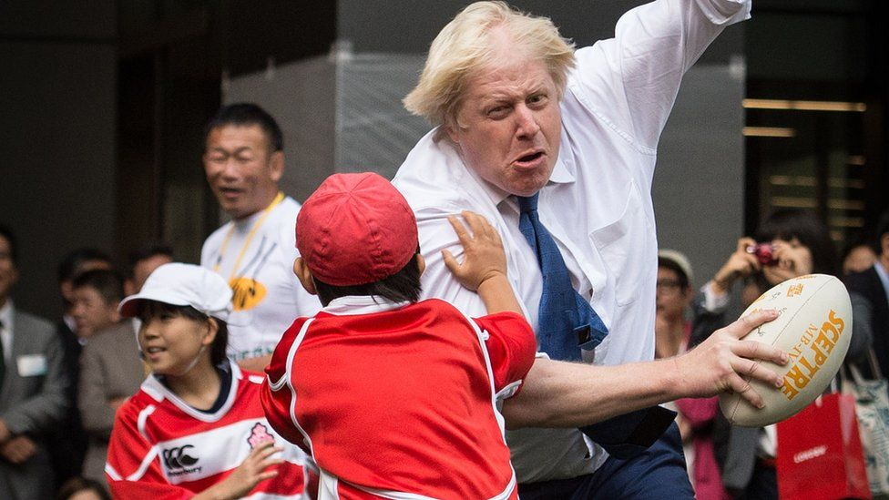
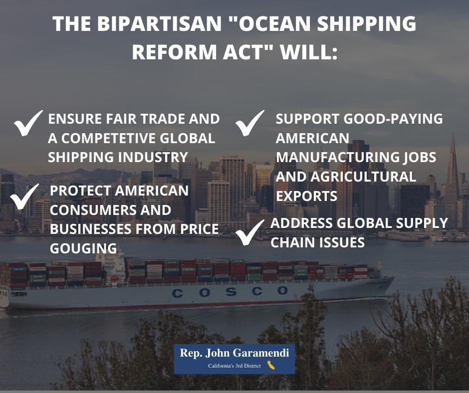
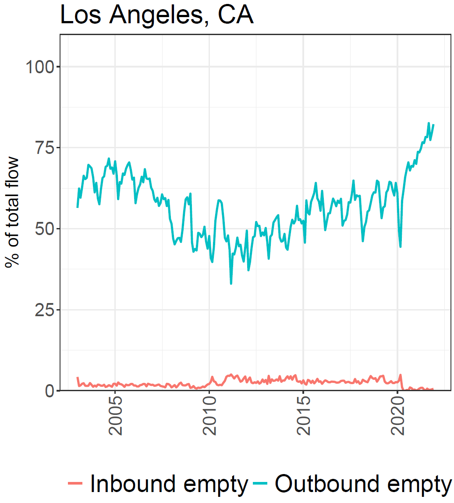
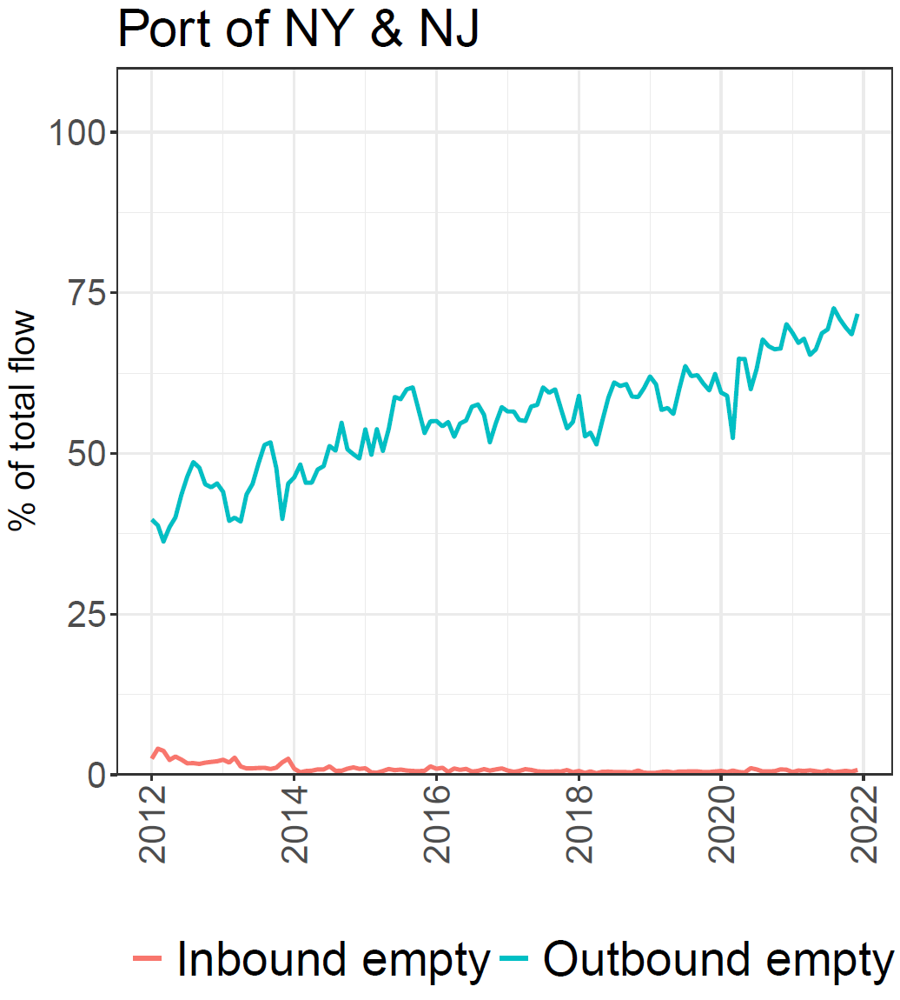

class: inverse, middle

```{r Setup, include = F}
options(htmltools.dir.version = FALSE)
library(pacman)
p_load(ggthemes, viridis, knitr, dslabs, gapminder, extrafont, Ecdat, wooldridge, tidyverse, magrittr, kableExtra, ggtext)
 
# Define colors
red_pink <- "#e64173"
met_slate <- "#272822" 
turquoise <- "#20B2AA"
orange <- "#FFA500"
red <- "#fb6107"
blue <- "#2b59c3"
green <- "#8bb174"
grey_light <- "grey70"
grey_mid <- "grey50"
grey_dark <- "grey20"
purple <- "#6A5ACD"
slate <- "#314f4f"
# Notes directory
dir_slides <- "~/Lectures/01-Intro"
# Knitr options
opts_chunk$set(
  comment = "#>",
  fig.align = "center",
  fig.height = 7,
  fig.width = 10.5,
  warning = F,
  message = F
)  
opts_chunk$set(dev = "svg")
options(device = function(file, width, height) {
  svg(tempfile(), width = width, height = height)
})
options(crayon.enabled = F)
options(knitr.table.format = "html")
```

```{css, echo = F}
@media print {
  .has-continuation {
    display: block !important;
  }
}


.pull-lefter {
  float: left;
  width: 67%;
}
.pull-rightish {
  float: right;
  width: 25%;
}

.pull-rightish ~ p {
  clear: both;
}

```

# Prologue

---

# Recap

<br>

### Previously

* Quotas similar to tariffs but yield greater economic losses

* Domestic producers tend to prefer quotas to tariffs

* Not every non-tariff measure is considered protectionist

--

### Today

Trade agreements, joint policy outcomes and assessing recent history with our new knowledge

---

# Coordinating Trade Policy

<br>

Most countries part of .hi-pink[World Trade Organization] and adhere to a default non-discriminatory .hi-pink["Most Favored Nations"] (MFN) tariff rate schedule.

--

This .hi-pink[MFN] tariff schedule applies by default to each country within the WTO.

--

Exceptions in the use of .hi-pink[regional trade agreements], which apply reduced tariffs to set of parties included in an agreement.

--

* Free Trade Agreement

--


* Preferential Trade Agreements

--

* Customs Unions


---

# Free Trade Agreement

<br>

--

Consists of:

* Reduction or elimination of tariffs on qualified

--

* Intellectual Property Protection

--

* Harmonized Product Standards

U.S. has 14 FTAs with 20 countries which comprise about 40 percent of U.S. goods’ exports, with a main goal of .hi-pink[eliminating tariffs]

---

# Preferential Trade Agreements

<br>

Similar to an .hi-pink[FTA] but usually only focuses on the .hi-pink[reduction of tariffs] and covers a .hi-pink[narrower set of products]

--

A preferential trade agreement can also just be .hi-pink[unilateral] or for a particular amount of years.

--

The US maintains Preferential Trade Agreements with approximately 187 countries.

---

# Customs Union

<br>

Goes a step above and beyond. .hi-pink[Zero tariff rate] among member countries.

--

Standardized rates of customs duties on goods imported from other countries

* EU is a prevalent example of this system, introduced in 1960s

--

UK exit from the European Union and the Customs Union .hi-pink[changed rules] for British businesses doing business in Europe. Rare case of **reversal** of trade liberalization.


---


# Creation and Diversion


<br>

There are notable economic effects of these regional trade agreements

--

* Trade increases between countries through .hi-pink[two types]

--

* .hi-pink[Trade creation] occurs if member country imports product from other member that it originally produced for itself

--

* .hi-pink[Trade diversion] occurs when a member country imports a product from another member that it formerly imported from a country _outside the new trade region_

---

# Creation and Diversion


<br>

.hi-pink[Trade creation]

--

* Consumer surplus gained at home due to importing greater number of goods sold at lower prices

--

* Producer surplus gained by exporting country which now sells a greater volume of goods

--

* Generates welfare gains to both countries

--

Since good was not traded before, these results are directly translatable from .hi-pink[Ricardian] and .hi-pink[HO] model predictions.

---

# Creation and Diversion


<br>

.hi-pink[Trade diversion]

--

* Diversion of trade away from country outside of the new trade region

--

* Will bring a loss in producer surplus due to reduced export sales

--

* May bring losses to countries inside free trade area too in certain cases

--

Consider the following numerical example.

---


# Creation and Diversion

.hi-pink[Numerical Example]

--

* Suppose China is currently the US main partner on motor part imports

--

* Mexico and the US negotiate a regional trade agreement that lowers tariffs

--

* China loses .hi-pink[producer surplus], whereas Mexico gains


--

* Mexico may not be the most efficient (lowest-cost) producer of parts

--

In fact, we know China was the .hi-pink[most efficient source] due to the precise reliance the US had on China. 

---


# Creation and Diversion

Consider the following table:

```{r, echo=FALSE}


tibble(
  a = c("From MEX, before PTA", "From CHN, before PTA", "From MEX, after PTA", "From CHN, after PTA", "From the US"),
  b = c("$20", "$19", "$20", "$19", "$22"),
  c = c("", "", "", "", ""),
  d = c("", "", "", "", "")
  ) %>% kbl(col.names=c("", "0%", "10%", "20%"),
            table.attr = "style='width:100%;'") %>% kable_styling()


```


Under this free trade scenario Chinese costs are the lowest, and their goods would be imported

---

# Creation and Diversion

<br>

```{r, echo=FALSE}


tibble(
  a = c("From MEX, before PTA", "From CHN, before PTA", "From MEX, after PTA", "From CHN, after PTA", "From the US"),
  b = c("$20", "$19", "$20", "$19", "$22"),
  c = c("$22", "$20.90", "$20", "$20.90", "$22"),
  d = c("", "", "", "", "")
  ) %>% kbl(col.names=c("", "0%", "10%", "20%"),
            table.attr = "style='width:100%;'") %>% kable_styling()


```

--

Under the .hi-pink[10% tariff] scenario, switching into a PTA makes Mexican goods suddenly become the cheapest option. 

---

# Creation and Diversion

<br>

```{r, echo=FALSE}


tibble(
  a = c("From MEX, before PTA", "From CHN, before PTA", "From MEX, after PTA", "From CHN, after PTA", "From the US"),
  b = c("$20", "$19", "$20", "$19", "$22"),
  c = c("$22", "$20.90", "$20", "$20.90", "$22"),
  d = c("$24", "$22.80", "$20", "$22.80", "22")
  ) %>% kbl(col.names=c("", "0%", "10%", "20%"),
            table.attr = "style='width:100%;'") %>% kable_styling()


```

--

PTA keeps Mexican auto part costs fixed at $20.

---

# Creation and Diversion


<br>

.hi-pink[Under 20% tariff MFN], US would have been paying $22 to produce goods domestically. 

--

.hi-pink[Trade Creation]: Upon forming a PTA, the US collects no tariffs from US importers shipping from Mexico. 

--

* Switch to Mexican imports at $20 per unit

--

* US gains from cost reduction relative to its previous scenario. Mexican exports rise.

--

* Chinese welfare neither gains or loses due to lack of pre-existing trade. 

---

# Creation and Diversion


<br>

.hi-pink[Under 10% tariff MFN], US would have been paying $20.90 to produce goods using Chinese imports. 

--

.hi-pink[Trade Diversion]: Upon forming a PTA, the US collects no tariffs from US importers shipping from Mexico. 

--

* Switch from Chinese to Mexican imports at $20 per unit

--

* US gains 90c on lower costs but loses 1.90 in tariff revenue, per unit welfare loss

--

* Producer surplus falls in China due to loss of pre-existing trade. 


---

# Reversal: Brexit

--

Voted on in 2016, took 4 years of negotiation to enact.

.hi-pink[Effective date]: 31st January 2020

--

So if trade agreements lead to more trade and more trade boosts welfare, why did the UK reverse all the progress it made in .hi-pink[trade liberalization]?

--

```{r, echo=FALSE, out.width="70%"}



```


---


# Reversal: Brexit

--

.hi-pink[How did negotiations go?]

--

Huge chaos throughout. UK assumed it would face continued free access to the EU single market due to its economic importance.

--

In reality, UK had derived about 13% of its GDP from exports to the EU, while conversely only 3% of the EU’s GDP derived from exports to the UK.

--

Although no tariffs are applied to trade, UK exporters have to prove they meet EU standards

* Was not previously necessary

* Leads to extra charges, taxes, paperwork and the halt of some exports to EU

---

# Reversal: Brexit

.hi-pink[How did negotiations go?]

One major hurdle: .hi-pink[1998 Good Friday (Belfast) Agreement]

--

* This earlier international agreement promises to keep open border between Ireland and Northern Ireland

* Infeasible if we need border control to check whether goods have appropriate documentation

--

* Compromise met by keeping NI in the European Single Market and allowing the Irish Sea to act as a trade border. 

--

* Goods are checked upon route between NI and rest of the UK. Politically sensitive decision for ardent UK supporters in NI.

---

# Reversal: Brexit

<br>

.hi-pink[What is the UK left with?]

--

* Brexit has reduced UK trade openness, foreign direct investment (FDI) inflows, and immigration growth

--

* New border frictions and higher transport costs pose new barriers to trade,

--

* FDI inflows are unlikely to return to levels reached in the 1990s and 2000s

--

* A less diverse workforce and lower FDI levels can also hamper productivity growth

---

# Unconventional Hidden Protection


```{r, echo=FALSE, out.width="80%"}



```

---

# Unconventional Hidden Protection

Recent policy seeks to intervene with containerized trade in the US. Why?

--

.pull-left[
```{r, echo=FALSE}



```
]

.pull-right[
```{r, echo=FALSE}



```
]

---

# Unconventional Hidden Protection

<br>

--

Recently the Biden Administrative has signed into law the .hi-pink[Ocean Shipping Reform Act 2022]. This act features:

--

* Punish transport operators charging excessive demmurge fees

--

* Penalize companies denying vessel capacity allocations to US exporters

--

* Drive up data requirements from transport operators


--

All of these policies will translate into higher shipping costs for the average US importer. How would you expect this to affect trade outcomes? 

--

.hi-pink[Less imports narrow gains from trade.]

---

# US and the WTO

<br>

Trump administration skeptical of dispute settlement procedure of WTO

--

* Used several provisions of trade law to apply tariffs that had only been used infrequently in that way

--

* Many countries objected to US impositions of tariffs

--

* Even before WTO ruling on legitimacy of tariffs, countries responded by applying tariffs to US exports


---

# US and the WTO

<br>

--

Since Dec 10 2019, WTO not able to issue rulings because several judges finished terms and US .hi-pink[blocked appointment of any new judges].

--

Ability of WTO to resolve issues between countries is heavily sensitive to US policitcal atmosphere.

--

.hi-pink[Managed Trade]: To resolve these matters and begin lowering tariff rates, US required China nearly double their imports of US goods. 

--

Given recent epidemic, triggering this kind of adoption of US goods has been .hi-pink[near-impossible to achieve]. 

---

# US and the WTO

--

China bought __none__ of the .hi-pink[additional $200 billion of exports] Trump's deal had promised.

--

* Trade war and phase on agreement did little to change China's economic policymaking

--

* Beijing intent on becoming more state-centered, less market-oriented

--

* With the December 31, 2021 deadline for the $200 billion of purchase commitments now past, US policymakers are seeking a different approach

--

* United States working with other major economies, e.g. Trade and Technology Council


---

.hi-pink[In Summary]

* A variety of trade agreements exist under current international norms

* Agreements riddled with uncertainty and not always welfare enhancing

* Multi-year negotiations can make or break a domestic economy

*  Even if policymakers agree multilateral purchase commitments with respect to China, they should learn right lessons from US experiences

--

.hi-pink[Next time!]

* How do international agreements fare with respect to the environment?


---

exclude: true

```{R generate pdfs, include = F, eval = F}
#remotes::install_github('rstudio/pagedown')
library(pagedown)
pagedown::chrome_print("09-int-agree.html", output = "09-int-agree.pdf")
```
