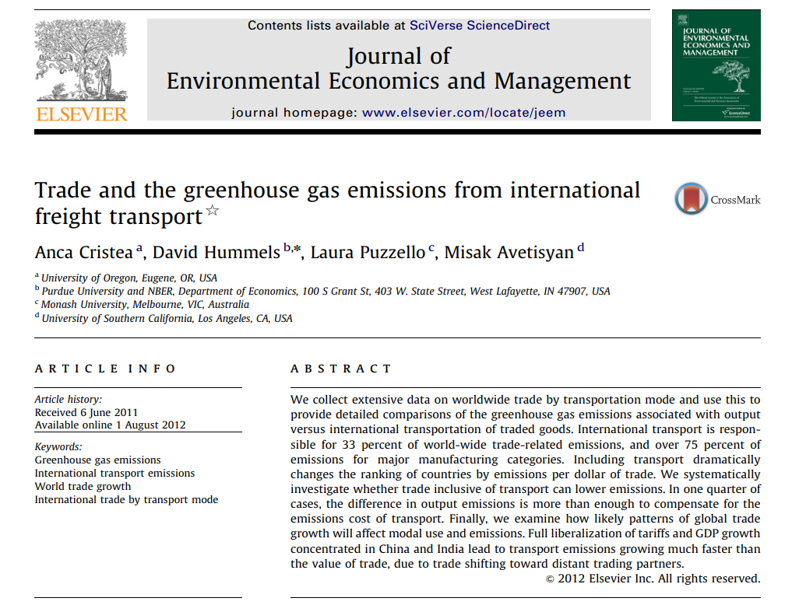
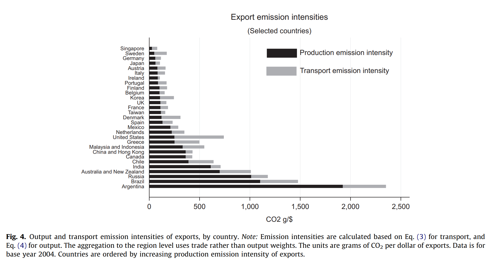

class: inverse, middle

```{r Setup, include = F}
options(htmltools.dir.version = FALSE)
library(pacman)
p_load(ggthemes, viridis, knitr, dslabs, gapminder, extrafont, Ecdat, wooldridge, tidyverse, magrittr, kableExtra, ggtext)
 
# Define colors
red_pink <- "#e64173"
met_slate <- "#272822" 
turquoise <- "#20B2AA"
orange <- "#FFA500"
red <- "#fb6107"
blue <- "#2b59c3"
green <- "#8bb174"
grey_light <- "grey70"
grey_mid <- "grey50"
grey_dark <- "grey20"
purple <- "#6A5ACD"
slate <- "#314f4f"
# Notes directory
dir_slides <- "~/Lectures/01-Intro"
# Knitr options
opts_chunk$set(
  comment = "#>",
  fig.align = "center",
  fig.height = 7,
  fig.width = 10.5,
  warning = F,
  message = F
)  
opts_chunk$set(dev = "svg")
options(device = function(file, width, height) {
  svg(tempfile(), width = width, height = height)
})
options(crayon.enabled = F)
options(knitr.table.format = "html")
```

```{css, echo = F}
@media print {
  .has-continuation {
    display: block !important;
  }
}


.pull-lefter {
  float: left;
  width: 67%;
}
.pull-rightish {
  float: right;
  width: 25%;
}

.pull-rightish ~ p {
  clear: both;
}

```


# Prologue

---

# Recap

### Previously

* A variety of trade agreements exist under current international norms

* Agreements riddled with uncertainty and not always welfare enhancing

* Multi-year negotiations can make or break a domestic economy

*  Even if policymakers agree multilateral purchase commitments with respect to China, they should learn right lessons from US experiences

--

### Today

* How do international agreements fare with respect to the environment?


---

# Background

The .hi-pink[WTO] nor any other central body presides over international agreements with respect to the environment

--

<br>

There are some 200 multilateral environmental agreements.

--

* Each country is a producer of pollution that is then distributed globally

--

* These .hi-pink[externalities] are common to each country, but only a lessor proportion of costs are borne by any particular emitter of pollution

--

* This leads to a .hi-pink[failure of free markets] that requires intervention across government

---

# Notable Agreements


* Convention on International Trade Endangering Species

--

* Montreal Protocol on Substances that Deplete Ozone Layer

--

* IMO 2020 Cutting Sulphur Oxide Emissions

--

WTO still influences environment indirectly. .hi-pink[GATT Article XX]: 

> subject to the requirement that such measures are not applied in a manner which would constitute a disguised restriction on international trade, nothing in this Agreement shall be construed to prevent the adoption or enforcement by any contracting party of measures (b) necessary to protect human, animal or plant life or health, ... (g) relating to the conversation of exhaustible natural resources if such measures are made effective in conjunction with restrictions on domestic production or consumption. 


---

# Issues


.hi-pink[Tuna-Dolphin Case]

<br>

--

* In 1991, before existence of WTO, US banned tuna imports from Mexico due to fishermen not using dolphin-friendly nets

--

* GATT concluded US could not ban imports because US applied restriction to __production process method__ and not the product itself

--

> "GATT rules did not allow one country to take trade action for the purpose of attempting to enforce its own domestic laws in another country - even to protect animal health or exhaustible natural resources". 


---


# Issues

<br>

```{r, echo=FALSE}

tibble(
  
  Case = c("Tuna-Dolphin", "Shrimp-Turtle", "Gasoline", "Biotech Food"),
  Issue = c("Ban on imports of Mexican tuna by US not caught in nets safe for dolphins", 
            "US ban on imports of shrimp from India, Malaysia, Pakistan not caught in nets safe for sea turtles", "US ban on imports of gasoline from Venezuela and Brazil because gas exceeded maximum allowed smog-causing chemical (under US Clean Air act)", 
            "Ban on GMO food or crops by the EU since 1998"),
  Outcome = c("GATT ruled in favor of Mexico. Strong consumer response led to net change.",
              "WTO ruled against US but US would still require use of nets provided adequate notice and consultation were pursued.", "Ruled against US for violating equal treatment between foreign and domestic producers.", "WTO ruled against EU citing need for judgement based on scientific risk assessments.")
) %>% kbl() %>% kable_styling(font_size=14)


```

--

Considerable outside pressure and loopholes have allowed each of these policies to be applied in the end. 

---

# Trade & Environment


.hi-pink[Does Trade Help or Harm the Environment?]


--

.hi-pink[Externalities]: These are affects of one individuals production or consumption on other individuals. 

--

* *Positive externalities* benefit the other users (e.g. scientific discovery) and *negative externalities* harm other users (e.g. indoor smoking)

* *Market failure* is a scenario in which positive or negative effects of externalities on other people are not fully paid for by the producer

* For example, if tech created by firm 1 is freely accessed by firm 2 with no payment made

---

# Trade & Environment


.hi-pink[Does trade incentivize or disincentize the production of externalities?]

--

There are some cases where having more trade raises the externalitiy and lowers welfare, and others where the opposite takes place.

--

If producing a .hi-pink[negative externality] domestically, trade $\implies$ lower market price $\implies$ lowers domestic quantity supplied

--

Less domestic production implies less of the externality being produced too. .hi-pink[Welfare improves and externality lowers].

--

If the production externality had been "a chance at triggering technological advancement", trade would contribute towards less of the positive externality and .hi-pink[harm welfare]. 

---

# Examples

.hi-pink[Trade in Fish]: 

Fish treated as common property. 29% of fish and seafood species have collapsed, with populations declining by at least 90% between 1950 and 2003. 

--

Since fish are an international resource, no single party .hi-pink[fully internalizes negative externalities] of producing these goods. 

--

Requires .hi-pink[international agreements] which assign property rights and limit overharvesting.

--

In absense of these measures, international trade enlarges the market for overfished products.

---

# Examples


.hi-pink[Trade in Buffalo]:


1870 saw London develop .hi-pink[new technology] for tanning buffalo hides, causing their demand to skyrocket.

--

A great deal of overhunting resulted in the near extinction of the species, following technology-spurred trade growth. 

--

A lack of property rights and government intervention contributed towards this great massacre of the species. 

--

The .hi-pink[Convention on International Trade in Endangered Species] (CITES) now protects over 5,000 animal and 29,000 plant species in order to avoid such outcomes through trade. 

---


# Examples

<br>

.hi-pink[Trade in Solar Panels]:


More panels implies __less emissions__ since per unit electricity consumption would be generated through increasingly greener sources.

--

A reduction in solar panel tariffs $\implies$ lower price of electricity, more use of it and __less negative pollution externalities__. 

--

Trade can contribute towards improvements in the environment as well as deterioration. 

---

# Empirics


```{r, echo=FALSE, out.width="80%"}



```


---

# Empirics

Per dollar value exports, which countries have the cleanest 2004 exports?

```{r, echo=FALSE, out.width="95%"}



```


---

# Empirics

<br>

* International transportation is a small fraction of .hi-pink[overall emissions] but a surprisingly large fraction of .hi-pink[trade-related emissions]

* $\frac{2}{3}$ of trade-related emissions in US exports are due to international transportation

* Many exporters and products that look relatively "clean", when focusing only on output emissions, are in fact .hi-pink[heavy emitters], once incorporating transportation

* Under .hi-pink[trade liberalization], transport emissions will become increasingly important, growing .hi-pink[twice as fast]` as the emission from trade-related output

---

.hi-pink[In Summary]

* Welfare gains and losses from trade agreements are complex and require case-wise assessment

* Welfare gains and losses from externalities and trade are complex, demanding similar scrutiny

* Market failures require direct government intervention through quotas, taxes and property right allocations

* As trade liberalizes, the externalities associated with relocating goods is expected to rise (further trade partners become more accessible)


---

exclude: true

```{R generate pdfs, include = F, eval = F}
#remotes::install_github('rstudio/pagedown')
library(pagedown)
pagedown::chrome_print("11-int-agree.html", output = "11-int-agree.pdf")
```
