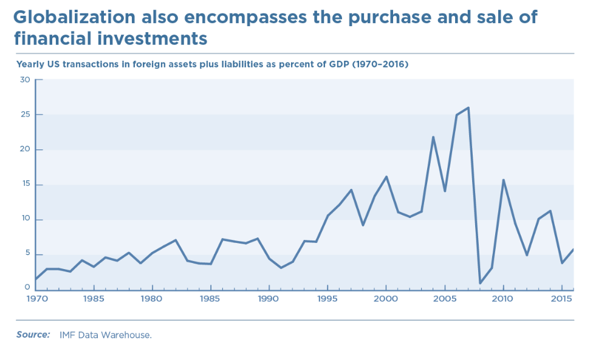

class: inverse, middle

```{r Setup, include = F}
options(htmltools.dir.version = FALSE)
library(pacman)
p_load(ggthemes, viridis, knitr, dslabs, gapminder, extrafont, Ecdat, wooldridge, tidyverse, magrittr, kableExtra, ggtext)
 
# Define colors
red_pink <- "#e64173"
met_slate <- "#272822" 
turquoise <- "#20B2AA"
orange <- "#FFA500"
red <- "#fb6107"
blue <- "#2b59c3"
green <- "#8bb174"
grey_light <- "grey70"
grey_mid <- "grey50"
grey_dark <- "grey20"
purple <- "#6A5ACD"
slate <- "#314f4f"
# Notes directory
dir_slides <- "~/Lectures/01-Intro"
# Knitr options
opts_chunk$set(
  comment = "#>",
  fig.align = "center",
  fig.height = 7,
  fig.width = 10.5,
  warning = F,
  message = F
)  
opts_chunk$set(dev = "svg")
options(device = function(file, width, height) {
  svg(tempfile(), width = width, height = height)
})
options(crayon.enabled = F)
options(knitr.table.format = "html")

`%ni%` <- Negate(`%in%`)
```

```{css, echo = F}
@media print {
  .has-continuation {
    display: block !important;
  }
}


.pull-lefter {
  float: left;
  width: 67%;
}
.pull-rightish {
  float: right;
  width: 25%;
}

.pull-rightish ~ p {
  clear: both;
}

```


# Prologue

---

# Recap

### Previously

* Welfare gains and losses from trade agreements are complex and require case-wise assessment

* Market failures require direct government intervention through quotas, taxes and property right allocations

* Trade highly detrimental to environmental outcomes, both through production and transportation of tradables, but welfare gains may outweigh (Shapiro 2016).


### Today

* Economic issues with respect to globalization patterns


---

# What is it?

<br>

.hi-pink[Globalization] 

> The growing interdependence of the world’s economies, cultures, and populations, brought about by cross-border trade in goods and services, technology, and flows of investment, people, and information.

--

The term is used broadly. We focus on international trade and some of the investment flows among advanced economies, mostly focusing on the United States.

---

# Big Picture

<br>

The wide-ranging effects of globalization, but all lessons thus far culminate to these points.

--

* Complex and politically charged

* As with major technological advances, globalization benefits society as a whole, while harming certain groups

--

Understanding the relative costs and benefits can pave the way for alleviating problems .hi-pink[while sustaining the wider payoffs].

---

# History

<br>

Took off in the 19th century. 

--

Following centuries of European colonization and trade activity, .hi-pink[first wave of globalization] propelled by steamships, railroads, the telegraph, and refrigeration.

--

Came alongside increased economic cooperation. This initial trend .hi-pink[eventually waned] and crashed in the catastrophe of WWI.

--

Followed by postwar .hi-pink[protectionism], the Great Depression, and WWII. 

---

# History

After WWII, United States led efforts to .hi-pink[revive international trade and investment] under negotiated ground rules.

--

> Bretton Woods Conference (1944) - Series of agreements led to exchange rate system (lasted until 1971); International Bank for Reconstruction and Development (IBRD), now known as the World Bank; and the International Monetary Fund (IMF). Two years later, 23 nations including UK/US, began reducing trade barriers, leading to General Agreement on Tariffs and Trade (GATT), which began operation in 1948.


--

.hi-pink[Second wave of globalization], which remains ongoing, though buffeted by periodic downturns and mounting political scrutiny.

---

# History

> *“I saw that you could not separate the idea of commerce from the idea of war and peace. ... [and] that wars were often largely caused by economic rivalry conducted unfairly. ...I embraced the philosophy that...unhampered trade dovetailed with peace; high tariffs, trade barriers, and unfair economic competition, with war. ...[I]f we could get a freer flow of trade—freer in the sense of fewer discrimination and obstructions - so that one country would not be deadly jealous of another and the living standards of all countries might rise, thereby eliminating the economic dissatisfaction that breeds war, we might have a reasonable chance for lasting peace.”*

Cordell Hull, Secretary of State under President Franklin D. Roosevelt, written in his memoirs in 1948.


---

# Era of Trade Liberalization

```{r, echo=FALSE, out.width="95%"}


```

---

# Era of Trade Liberalization

```{r, echo=FALSE, out.width="95%"}


```

---

# Global Value Chains

<br>

.hi-pink[Global supply chains] are production networks that assemble products using parts from around the world (known as intermediate goods). 

--

This has resulted in the presence of .hi-pink[intermediate inputs] increasing within trade, relative to final good flows.

--

Today, .hi-pink[80 percent of world trade] is driven by supply chains run by multinational corporations. 

--

Trade in intermediate goods is now nearly .hi-pink[twice as large] as trade in final goods and is especially important in advanced manufacturing, like autos.

---

# Global Value Chains

```{r, echo=FALSE, out.width="95%"}


```


---

# Global Value Chains

```{r, echo=FALSE, out.width="95%"}


```

---

# Financial Integration

<br>

Separate from trade in goods and services, global .hi-pink[financial integration] is a much-debated but important topic. Here is a quick summary.

* US flow of foreign investments has been .hi-pink[declining since 2008], off-trend from previous stance.

--

* Many countries have .hi-pink[large international financial flows] or investments, consisting of assets and liabilities (FDI, securities, and debts).

--

* Countries have become susceptible to .hi-pink[sudden stops and surges] in these flows, leading to greater economic volatility for developing nations.

---

# Financial Integration

```{r, echo=FALSE, out.width="95%"}



```

---

# Financial Integration

```{r, echo=FALSE, out.width="95%"}


```

---

# Financial Integration

```{r, echo=FALSE, out.width="95%"}


```


---

# Goal of Globalization

<br>

The US established a global economic order governed by mutually accepted rules and overseen by multilateral institutions.

--

The idea has been to create a better world with countries seeking to cooperate with one another to promote .hi-pink[prosperity and peace]. 

--

.hi-pink[Free trade] and the .hi-pink[rule of law] were mainstays of the system, helping to prevent most economic disputes from escalating into larger conflicts.

---

# Key Institutions

```{r, echo=FALSE, out.width="95%"}


```


---

# Effects of Globalization

We have covered a great deal of this thus far through our review of the theory and surrounding empirical literature. To summarize our knowns:

--

* More goods at lower prices through exploiting comparative advantages

* Scaled up enterprises, multinationals, allowing for large-scale technological developments

* Better quality and variety of goods, as a result of increased product-level competition

* Supports new job opportunities but also contributes to job displacement.

---

# Globalization: Jobs

<br>

It does not significantly change the total number of positions in the economy, as job numbers are primarily driven by business cycles and Federal Reserve and fiscal policies. 

--

.hi-pink[Peterson Institute studies] finds 156,250 US manufacturing jobs lost on net each year between 2001 and 2016 from expanded trade in manufactured goods.

--

Represents .hi-pink[less than 1%] of the workers laid off in a typical year.

---

# Globalization: Jobs

<br>

.hi-pink[Low-wage workers] in certain regions are most affected. Many of them also face lower earnings or have dropped out of the workforce. 

--

.hi-pink[Bigger factors] than trade that drive job displacements are labor-saving technologies, like automated machines and artificial intelligence. 

--

Better-paying positions have opened up in manufactured exports - especially in .hi-pink[high-tech areas], such as computers, chemicals, and transportation equipment.


---

# Globalization: Income

Decline in global income inequality but .hi-pink[has risen in the US].

Globalization helped narrow inequality between poorest and richest people in the world, number living in extreme poverty cut by half since 1990. 

A [consensus of scholarly work](https://www.piie.com/blogs/trade-and-investment-policy-watch/has-global-trade-fueled-us-wage-inequality-survey-experts) holds that globalization contributed marginally to rising US wage inequality (10% to 20%). 

Leading explanation - technology reducing low- and middle-wage worker demand and increasing demand for high-skilled, higher-paid workers. 

Countries exposed to globalization have alleviated inequality to different degrees through tax and welfare systems. US has done .hi-pink[the least among advanced economies] to mobilize government policies .hi-pink[to reduce inequality].


---

# Globalization: Job Displacement

<br>

Globalization changes types of jobs available, *little effect on the overall number of jobs*. 

--

Some workers have directly benefited from expanding global commerce, while others have not. 

--

Certain manufacturing and industry workers in specific geographic regions lost out, such as those in furniture, apparel, steel, auto parts, and electrical equipment industries in Tennessee, Michigan, and the mid-Atlantic states. 

--

.hi-pink[We've seen some of this in our review of Autor et al. (2016)]


---

# Globalization: Entry Firms

<br>

.hi-pink[Foreign-owned companies] that do business in the US have hired Americans at a *faster rate than US private employers between 2007 and 2015*. 

--

One in five American manufacturing workers is now employed by a foreign-owned company operating in the United States.

--

They also pay better, do more research and development, export more, and invest more than the average US firm. 

--

.hi-pink[The same is true of US firms that invest abroad.]


---

# Globalization: Why Support?

Between 1950 to 2016 trade expansion 

* Increased size of US economy by 2.1 Trillion USD, 18k per household every year

* US manufacturing employment +100k from job creation, -200k from import competition dwarfed by overall -4 mil between 2001-2016

* 51 to 1 payoff to US GDP compared to wage losses of affected workers since the end of WWII.

.hi-pink[Wage losses are temporary while the gains are reccurent and accumlating over time.] 

--

*Source: Gary Clyde Hufbauer and Zhiyao (Lucy) Lu, The Payoff to America from Globalization: A Fresh Look with a Focus on Costs to Workers. *


---

# Public Views

<br>

How do Americans feel about globalization? 

* Listening to the debates can be confusing. 

* Not surprisingly, polls vary widely depending on how and when the question is posed.

* Can be a hard sell to the public because the benefits are widely distributed and not as easily understood

--

.hi-pink[Not helped by the US's inaction at helping temporarily displaced workers]

---

# Public Views

```{r, echo=FALSE, out.width="95%"}


```

---

# Public Views

An [OECD Study](https://www.oecd.org/els/soc/dividedwestandwhyinequalitykeepsrising.htm) suggests policymakers did little to help workers adjust at a time when the wealthiest Americans have gained the most.

--

In general, younger people are .hi-pink[more supportive of free trade], as most have never known a world without the current system.

--

Before 2016, Republicans generally .hi-pink[favored US trade deals] and Democrats generally voted against them.

--

President Trump canceled TPP and threatened withdrawing from NAFTA, the Korea-US Free Trade Agreement (KORUS) and the WTO. The Trump administration pushed for more power to impose tariffs.

---

# Policy Action

<br>

The global economy has yielded enormous economic gains for the United States, but .hi-pink[problems undoubtedly remain]. 

* Abuses within the system and rules need to be updated. 

* Trade agreements should account for the modern digital age. 

* Disputes continue on the trade of certain goods - flooding other markets too much, industries being subsidized, lingering protections on specific goods or economic sectors, etc. 

Solving these issues, which will inevitably arise and change over time, is best done through negotiation and coordination with trading partners

---

# Policy Action

<br>

Ideally, stakeholders aim to prevent costly trade wars, where more and more barriers end up hurting all sides.

* Trade negotiations can only go so far. Not enough done to help those who have lost out from import competition. 

* Manual work is increasingly being automated, lowering demand for workers. Wages stagnant, as health care and higher education costs rise. 

* Inequality is widening.

---

# Policy Action

Here are some of the crucial areas that economists have proposed the United States should focus on:

* Invest in better and more inclusive education.

* Give all displaced workers sufficient financial and administrative support

* Address growing income inequality through the tax system and spending programs.

* Make sure the healthcare system does not impede workers from finding new jobs 

* Coordinate with allies to confront trade abuses.


---

exclude: true

```{R generate pdfs, include = F, eval = F}
#remotes::install_github('rstudio/pagedown')
library(pagedown)
pagedown::chrome_print("12-globalization.html", output = "12-globalization.pdf")
```
