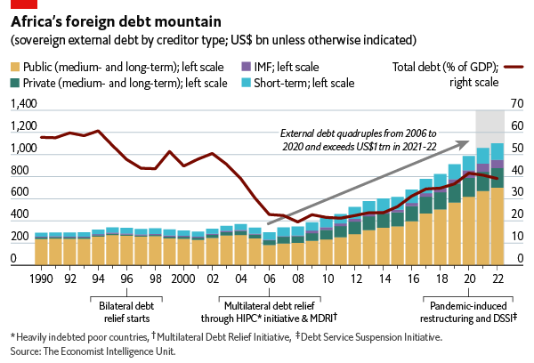

class: inverse, middle

```{r Setup, include = F}
options(htmltools.dir.version = FALSE)
library(pacman)
p_load(ggthemes, viridis, knitr, dslabs, gapminder, extrafont, Ecdat, wooldridge, tidyverse, magrittr, kableExtra, ggtext, data.table)

red_pink <- "#e64173"
met_slate <- "#272822" 
turquoise <- "#20B2AA"
orange <- "#FFA500"
red <- "#fb6107"
blue <- "#2b59c3"
green <- "#8bb174"
grey_light <- "grey70"
grey_mid <- "grey50"
grey_dark <- "grey20"
purple <- "#6A5ACD"
slate <- "#314f4f"
# Notes directory
dir_slides <- "~/Lectures/01-Intro"
# Knitr options
opts_chunk$set(
  comment = "#>",
  fig.align = "center",
  fig.height = 7,
  fig.width = 10.5,
  warning = F,
  message = F
)  
opts_chunk$set(dev = "svg")
options(device = function(file, width, height) {
  svg(tempfile(), width = width, height = height)
})
options(crayon.enabled = F)
options(knitr.table.format = "html")
```

```{css, echo = F}
@media print {
  .has-continuation {
    display: block !important;
  }
}


.pull-lefter {
  float: left;
  width: 67%;
}
.pull-rightish {
  float: right;
  width: 25%;
}

.pull-rightish ~ p {
  clear: both;
}

```


# Prologue

---

# Recap

### Previously

* Contents of Balance of Payments

* Financial Account features

--

### Today

* International Debt

* Investment Position

* Introducing exchange rates


---


# Limits on Financial Flows


<br>

Last time we discussed financial account flows.

A .hi-pink[trade-off] exists with respect to allowing greater financial flexibility and increase exposure to international financial crises/capital flight.

--

* Countries risk becoming reliant on external sources of liquidity

* A quick change in the business cycle could result in a large-scale exodus of liquidity

* Asset prices drop, indebtedness intensifies


---


# National Accounts + Deficit

<br> .hi-pink[National income and product accounts (NIPA).]

--

_Gross domestic product_ .hi-pink[(GDP)]: value of all final goods and services produced inside its borders during some time period.

--

_Gross national product_ .hi-pink[(GNP)]: value of all final goods and services produced by the labor, capital, and other resources of a country, regardless of where production occurred

--

<br>

$$\text{GNP} = \text{GDP} + \text{foreign income received} - \text{income paid to foreigners} +\\ \text{foreign transgers received} - \text{transfers paid to foreigners}$$


---


# National Accounts + Deficit

<br>

$$\text{GNP} = \text{GDP} + (\text{Net Primary Income} + \text{Net Secondary Income})$$

--

Standard macro: $GDP = C+I+G+X-M$ 

--

$$\text{GNP} = C+I+G+  \underbrace{(X-M+ \text{Net Primary} + \text{Net Secondary})}_{\text{Current Account}}$$

<br>

--

GNP is also the value of income received


---

# National Accounts + Deficit


GNP is also the value of income received.

--

Individuals may .hi-pink[consume income (C)], .hi-pink[save it (S)], or use it to .hi-pink[pay taxes (T)]. In reality, all of us do a combination of the three.

--

$$\text{National Income} = \text{GNP} = C + S + T$$

--

Setting output equal to income:

$$ C + I + G + CA = C + S + T \ \ \implies \ \ I + G + A = S + T$$

--

$$S + (T-G) = I + CA$$

--

Supposing .hi-pink[balanced government budget], savings are equal to total investment in the country plus current account net flows

---


# National Savings

Nation’s savings (private plus public) is divided into .hi-pink[two uses]. 

* Source of funds for .hi-pink[domestic investment] (I). 

* If government budgets are in deficit, overall LHS down, and all else being equal, investment falls. 

* Govt budget surplus increase the funds available for investment.

* Source of funds for .hi-pink[foreign investment]. 

* If CA surplus, national savings finances purchase of domestic goods by foreign users of those goods. In return, domestic economy acquires foreign financial assets. 

---

# National Savings

Recall .hi-pink[financial account] reflects the same amount of lending or borrowing as CA. 

--

If $\text{CA}<0$, financial account features net borrowing greater than net acquisition of financial assets (lending, or financial outflows). 

* Negative current account $\implies$ net borrowing in the financial account, inflow of financial capital. 

* Surplus countries provide savings to rest of world, enabling sale of more goods abroad than they buy. 

* Financial capital outflow is investment because involves acquisition of assets that are expected to pay a future return. 

---

# National Savings

<br>


Hence, another name for the current account balance is .hi-pink[net foreign investment]. 

Negative balance implies that foreigners accumulate more home country assets than the home country accumulates abroad.

US has had a .hi-pink[CA deficit] every year since 1981. Financial crisis of 2007–2009 had a dramatic effect on savings, investment, and government budgets.

Savings rose, investment fell. Federal budgets fell into large deficits. Improvement in .hi-pink[CA balance] as falling due to less imports.

---

# Current Account Deficit

<br>

.hi-pink[Are Current Account Deficits Harmful?]

--

The relationship between the current account balance, investment, and total national savings is an .hi-pink[identity]. 

--

Does not tell us why economy runs CA deficit or surplus.

--

$$S + (T-G) = I + CA$$

--

We cannot say CA in deficit because .hi-pink[saving is too low] any more than we can say it is because .hi-pink[investment is too high].

---

# Current Account Deficit

<br>

General tendency in the media and public to interpret CA deficit as a sign of weakness and as harmful to the nation’s welfare. 

--

Deficit .hi-pink[enables more investment] than would be possible otherwise (higher investment $\implies$ higher living standards) 

--

Capital inflows associated with current account deficits are .hi-pink[implicit vote of confidence by foreigners]. 

---

# Current Account Deficit

<br>

For example, between 1980 and 1991, Japan invested +$25 billion of .hi-pink[trade surplus] in US manufacturing. 

--

By early 90s, employing more than 100,000 US workers. Investment came during major domestic layoffs. 

--

Japanese firms acquired capital, built new plants w/ Japanese savings. 

--

During the US CA deficits of the 1990s, foreign investors continued to pour in capital, enabling increased productivity despite declining savings rate. 

--

.hi-pink[CA deficit enabled more investment than was possible otherwise].


---


# Current Account Deficit

<br>

.hi-pink[CA deficits can also generate problems.]

--

Capital inflows that occur with CA deficit increase stock of foreign-owned assets in home country.

--

Home now far more exposed to foreign policy/foreign business cycle conditions.

A sudden change in investor expectations about the home country’s future or their country's prospects can lead to a .hi-pink[sudden surge in capital outflows].

--

In .hi-pink[worst-case scenario], capital flight is followed by a depletion of international reserves and a financial crisis. 


---


# Current Account Deficit

Experience shared by a number of developing countries since the 1980s

--

Deficits allow countries to invest more, huge opportunity for developing countries where investment capital is scarce. 

--

International financial crises, like some biological diseases, tend to be .hi-pink[contagious]. 

--

> When Mexico slipped into __peso crisis__ in late 1994 and early 1995, economists began to write about “Tequila effect” on Latin America. When Thailand’s currency lost a large share of its value in 1997, media reported crisis spreading across East Asia. In both cases, the size of a CA balances was not good predictor of whether it was drawn into the crisis.


---


# International Debt

<br>

CA deficits financed through inflows of financial capital. 

--

Capital inflows take different forms, from direct investment to purchases of stocks, bonds, and currency, to loans.

--

Loans from abroad add to a country’s stock of .hi-pink[external debt] and generate .hi-pink[debt service obligations].

--

.hi-pink[External debt is defined as a debt that must be paid in a foreign currency.]

---


# International Debt

Debt service becomes .hi-pink[unsustainable burden], holds back economic development.

--

```{r, echo=FALSE}

```

---


# International Debt

<br>

Most countries, rich and poor, have external debt.

--

In .hi-pink[high-income countries], debt service is rarely an issue.

Usually relatively small compared to the size of the economy. Able to borrow in their own currencies. 

--

.hi-pink[Low- and middle-income countries] are another matter. 

Size of the external debt burden is unsustainable, given the economy’s ability to make interest payments and to repay the principal.


---


# International Debt

Unsustainable debt occurs for many reasons. 

* Sometimes, countries are .hi-pink[dependent on exports] of one or two basic commodities such as copper or coffee. 

* Shock of a sudden drop in world commodity prices reduces value of exports and generates unexpectedly large current account deficits. 

* In other cases, countries experience .hi-pink[natural disasters], such as hurricanes and earthquake

* .hi-pink[Corruption], too, can play a role, as autocrates empty national coffers. 

* Even electoral politics may be a factor, as when officials try to gain support through .hi-pink[unsustainable expenditures] targeted at important constituents. 

---

# International Debt

.hi-pink[Drawbacks]

Worsens budget position by adding repayments made to outsiders $\implies$ reduces .hi-pink[availability of public funds] for important domestic needs such as infrastructure, schools, and health care.

--

In addition, many examples of excessive debt burdens that have .hi-pink[spiralled] intensified and spread economic crises. 

--

.hi-pink[Highly Indebted Poor Country (HIPC) program].

--

Joint venture of WB, IMF, and various governments.

--

Provide debt forgiveness for select countries that must qualify based on .hi-pink[high levels of poverty and debt] and a .hi-pink[track record of economic reform].


---


# Investment Position

<br>


If a nation runs a .hi-pink[current account deficit], it .hi-pink[borrows from abroad] and adds to its indebtedness to foreigner.

--

.hi-pink[International investment position]: _Domestic assets owned by foreigners subtracted from foreign assets owned by residents of Home._

--

<br>

International investment position of 2019 (USA) was 10,991 bn USD.

--

Each year a country experiences a .hi-pink[CA deficit], foreigners acquire more assets locally than its residents acquire abroad.


---

# Brexit Investment Position


So what happened to the UK CA and capital flows during .hi-pink[Brexit]?

--

Quick recap:

* In 2016, the UK voted to leave the European Union and strike up their on trade relationships

--

* Wanted continued access to .hi-pink[free trade with EU] while deviating from common tariff schedule/regulatory standards and blocking free movement of labor. 

--

* Negotiations were largely a source of embarrassment for the UK - quickly clear they did not have sufficient .hi-pink[bargaining power] to achieve ideal deal.

---

# Brexit Investment Position

.hi-pink[How did the market respond?]

--

```{r, echo=FALSE, out.width="90%"}

exr = fread("data/DEXUSUK.csv")

ggplot(exr) + ylab("USD per GBP") + xlab("")+
  geom_ribbon(aes(x=DATE, ymin=1.0, ymax=DEXUSUK), 
              color = "#004362", fill="#006897", alpha=0.7) +
  scale_y_continuous(expand=c(0,0))+
  geom_vline(xintercept=16800)+
  #scale_x_continuous(expand=c(0,0))+
  theme_bw()+ 
  ggtitle("UK Exchange Rate (GBP:USD)") +
  theme(axis.text.x = element_text(size=15),
        axis.text.y = element_text(size=15),
        axis.title.x = element_text(size=18),
        axis.title.y = element_text(size=18),
        plot.title = element_text(size=18))

```

Severe loss of confidence in UK economic performance


---

# Current Account

```{r, include=FALSE}

ca_uk = fread("data/series-130922.csv")

colnames(ca_uk[-c(1:7),])

colnames(ca_uk) = c("year", "ca_perc")

ca_uk = ca_uk[-c(1:7),] %>% mutate(ca_perc = as.numeric(ca_perc)) %>% filter(year>=2010)

class(as.Date(ca_uk$year, format="%Y"))
```

```{r, echo=FALSE}

ggplot(ca_uk)+
  geom_line(aes(x=year, y=ca_perc), group=1) +
  theme_bw() + xlab("") + ylab("%") + 
  ggtitle("UK Current Account as % of GDP") +
  theme(axis.text.x = element_text(size=15),
        axis.text.y = element_text(size=15),
        axis.title.x = element_text(size=18),
        axis.title.y = element_text(size=18),
        plot.title = element_text(size=18))

```


---

# Summary

### Recapping

* National accounts and CA balance interconnected

* Deficit is not a sign of economic/geopolitical weakness

* A deficit implies borrowing from abroad, but investments can be very fruitful


--

### Next time

* Exchange Rate Adjustments (SR + LR)

---

exclude: true

```{R generate pdfs, include = F, eval = F}
#remotes::install_github('rstudio/pagedown')
library(pagedown)
pagedown::chrome_print("14-BoP-II.html", output = "14-BoP-II.pdf")
```