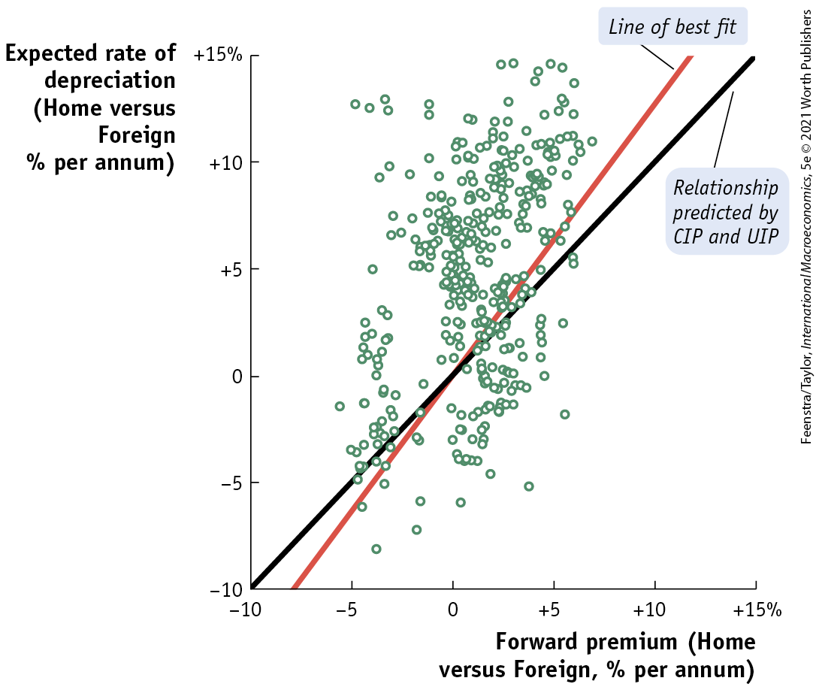

class: inverse, middle

```{r Setup, include = F}
options(htmltools.dir.version = FALSE)
library(pacman)
p_load(ggthemes, viridis, knitr, dslabs, gapminder, extrafont, Ecdat, wooldridge, tidyverse, magrittr, kableExtra, ggtext, data.table)

red_pink <- "#e64173"
met_slate <- "#272822" 
turquoise <- "#20B2AA"
orange <- "#FFA500"
red <- "#fb6107"
blue <- "#2b59c3"
green <- "#8bb174"
grey_light <- "grey70"
grey_mid <- "grey50"
grey_dark <- "grey20"
purple <- "#6A5ACD"
slate <- "#314f4f"
# Notes directory
dir_slides <- "~/Lectures/01-Intro"
# Knitr options
opts_chunk$set(
  comment = "#>",
  fig.align = "center",
  fig.height = 7,
  fig.width = 10.5,
  warning = F,
  message = F
)  
opts_chunk$set(dev = "svg")
options(device = function(file, width, height) {
  svg(tempfile(), width = width, height = height)
})
options(crayon.enabled = F)
options(knitr.table.format = "html")
```

```{css, echo = F}
@media print {
  .has-continuation {
    display: block !important;
  }
}


.pull-lefter {
  float: left;
  width: 67%;
}
.pull-rightish {
  float: right;
  width: 25%;
}

.pull-rightish ~ p {
  clear: both;
}

```


# Prologue

---

# Recap

* Exchange rates determine price of foreign goods

* Numerous reasons to hold foreign reserves

* Shifts in exchange rates often mirror changes in demand and supply of currencies

* PPP holds only in LR

### Today

* SR, Medium exchange rates and ExR Systems


---


# Topics

<br>

* Reasons for holding foreign reserves, main institutions


* Effect of $\Delta S, \Delta D$ of foreign currency on home currency


* __Identify short, medium and long term forces that affect currency value__


* Three rules of gold standard


* Compare and contrast various exchange rate systems


* Price changes and real exchange rate interactions


* List conditions necessary to form single currency area


---

# FX Market: Flexible

```{r, echo=FALSE, out.width="95%", warning=FALSE}

tibble(
    country  = c("Supply", "Supply",
                 "Demand", "Demand"),
    pies     = c(10, 90, 90, 5),
    ExR  = c(0.95, 1.40, 1.05, 1.4)
) %>% ggplot() +
    geom_line(aes(x=pies, y=ExR, color=country), size=2) +
    theme_bw() + 
    scale_y_continuous(expand=c(0,0), limits=c(0.9,1.5)) + 
    scale_x_continuous(expand=c(0,0), limits=c(0,100)) +
    #coord_fixed() + 
    ggtitle("US market for GBP") + 
    theme(title = element_text(size=14),
          legend.position = "right",
          legend.title = element_blank(),
          legend.text = element_text(size=16),
          axis.title.x = element_text(size=16),
          axis.title.y = element_text(size=16),
          axis.text.x = element_text(size=14),
          axis.text.y = element_text(size=14))+
    geom_point(aes(x=54,y=1.2), size=3) + xlab("Units of GBP") + ylab("ExR, USD/GBP") +
    geom_segment(aes(x=0, xend=54, y=1.2, yend=1.2), linetype="dashed")+
    geom_segment(aes(x=54, xend=54, y=0.9, yend=1.2), linetype="dashed")+
    geom_label(aes(x=59, y=1.17), label="E", size=4, position = position_dodge(0.9),
               vjust = 0) +
  scale_color_manual(values=c("#006797","#cd2828"))

```

---

# FX Market: Flexible


---


# FX Market: Flexible

Decreased demand for GBP in USA (D2 $\leftarrow$ D1)

```{r, echo=FALSE, out.width="85%", warning=FALSE}

tibble(
    country  = c("S", "S",
                 "D1", "D1",
                 "D2", "D2"),
    pies     = c(10, 90, 90, 5, 90, 5),
    ExR  = c(0.95, 1.40, 1.05, 1.4, 0.95, 1.3)
) %>% ggplot() +
    geom_line(aes(x=pies, y=ExR, color=country), size=2) +
    theme_bw() + 
    scale_y_continuous(expand=c(0,0), limits=c(0.9,1.6)) + 
    scale_x_continuous(expand=c(0,0), limits=c(0,100)) +
    #coord_fixed() + 
    ggtitle("US market for GBP") + 
    theme(title = element_text(size=14),
          legend.position = "right",
          legend.title = element_blank(),
          legend.text = element_text(size=16),
          axis.title.x = element_text(size=16),
          axis.title.y = element_text(size=16),
          axis.text.x = element_text(size=14),
          axis.text.y = element_text(size=14))+
    geom_point(aes(x=54,y=1.2), size=3) + xlab("Units of GBP") + ylab("ExR, USD/GBP") +
    geom_point(aes(x=44,y=1.14), size=3) +
    geom_segment(aes(x=0, xend=54, y=1.2, yend=1.2), linetype="dashed")+
    geom_segment(aes(x=54, xend=54, y=0.9, yend=1.2), linetype="dashed")+
    geom_segment(aes(x=0, xend=44, y=1.14, yend=1.14), linetype="dashed")+
    geom_segment(aes(x=44, xend=44, y=0.9, yend=1.14), linetype="dashed")+
    geom_label(aes(x=59, y=1.17), label="E", size=4, position = position_dodge(0.9),
               vjust = 0) +
    geom_label(aes(x=47, y=1.12), label="E'", size=4, position = position_dodge(0.9),
               vjust = 0) +
  scale_color_manual(values=c("#006797","#0087c5","#cd2828"))

```

---

# FX Market: Medium Run

<br>

Usually a 4-5 year range, where countries experience ebbs and flows of .hi-pink[business cycle] booms and busts.

--

During boom periods, incomes tick up, .hi-pink[aggregate demand rises] across consumers

--

Some of that spills over into .hi-pink[increased demand for imports].

--

This implies a greater need for foreign currency. 


---

# FX Market: Medium Run

Increased demand for GBP in USA (D1 $\rightarrow$ D2)

```{r, echo=FALSE, out.width="85%", warning=FALSE}

tibble(
    country  = c("S", "S",
                 "D1", "D1",
                 "D2", "D2"),
    pies     = c(10, 90, 90, 5, 90, 5),
    ExR  = c(0.95, 1.40, 1.05, 1.4, 1.15, 1.5)
) %>% ggplot() +
    geom_line(aes(x=pies, y=ExR, color=country), size=2) +
    theme_bw() + 
    scale_y_continuous(expand=c(0,0), limits=c(0.9,1.6)) + 
    scale_x_continuous(expand=c(0,0), limits=c(0,100)) +
    #coord_fixed() + 
    ggtitle("US market for GBP") + 
    theme(title = element_text(size=14),
          legend.position = "right",
          legend.title = element_blank(),
          legend.text = element_text(size=16),
          axis.title.x = element_text(size=16),
          axis.title.y = element_text(size=16),
          axis.text.x = element_text(size=14),
          axis.text.y = element_text(size=14))+
    geom_point(aes(x=54,y=1.2), size=3) + xlab("Units of GBP") + ylab("ExR, USD/GBP") +
    geom_point(aes(x=64.5,y=1.26), size=3) +
    geom_segment(aes(x=0, xend=54, y=1.2, yend=1.2), linetype="dashed")+
    geom_segment(aes(x=54, xend=54, y=0.9, yend=1.2), linetype="dashed")+
    geom_segment(aes(x=0, xend=64.5, y=1.26, yend=1.26), linetype="dashed")+
    geom_segment(aes(x=64.5, xend=64.5, y=0.9, yend=1.26), linetype="dashed")+
    geom_label(aes(x=59, y=1.17), label="E", size=4, position = position_dodge(0.9),
               vjust = 0) +
    geom_label(aes(x=71, y=1.25), label="E'", size=4, position = position_dodge(0.9),
               vjust = 0) +
  scale_color_manual(values=c("#006797","#0087c5","#cd2828"))

```


---


# FX Market: Medium Run

Suppose UK sees economic boom, increased import of US goods, higher GBP reserves (S1 $\rightarrow$ S2)

```{r, echo=FALSE, out.width="85%", warning=FALSE}

tibble(
    country  = c("S1", "S1",
                 "D", "D",
                 "S2", "S2"),
    pies     = c(10, 90, 90, 5, 20, 100),
    ExR  = c(0.95, 1.40, 1.05, 1.4, 0.95, 1.40)
) %>% ggplot() +
    geom_line(aes(x=pies, y=ExR, color=country), size=2) +
    theme_bw() + 
    scale_y_continuous(expand=c(0,0), limits=c(0.9,1.6)) + 
    scale_x_continuous(expand=c(0,0), limits=c(0,100)) +
    #coord_fixed() + 
    ggtitle("US market for GBP") + 
    theme(title = element_text(size=14),
          legend.position = "right",
          legend.title = element_blank(),
          legend.text = element_text(size=16),
          axis.title.x = element_text(size=16),
          axis.title.y = element_text(size=16),
          axis.text.x = element_text(size=14),
          axis.text.y = element_text(size=14))+
    geom_point(aes(x=54,y=1.2), size=3) + xlab("Units of GBP") + ylab("ExR, USD/GBP") +
    geom_point(aes(x=60,y=1.175), size=3) +
    geom_segment(aes(x=0, xend=54, y=1.2, yend=1.2), linetype="dashed")+
    geom_segment(aes(x=54, xend=54, y=0.9, yend=1.2), linetype="dashed")+
    geom_segment(aes(x=0, xend=60, y=1.175, yend=1.175), linetype="dashed")+
    geom_segment(aes(x=60, xend=60, y=0.9, yend=1.175), linetype="dashed")+
    geom_label(aes(x=57.1, y=1.172), label="E", size=4, position = position_dodge(0.9),
               vjust = 0) +
    geom_label(aes(x=63, y=1.162), label="E'", size=4, position = position_dodge(0.9),
               vjust = 0) +
  scale_color_manual(values=c("#006797","#cd2828","#e41616"))

```


---

# FX Market: Short Run

Short run is a time period of one year or less. 

--

We observe continuous day-to-day fluctuations in exchange rates. 


```{r, echo=FALSE, warning=FALSE, out.width="75%"}

exr_usd = fread("data/DEXUSEU.csv") %>% mutate(DATE = as.Date(DATE, format="%Y-%m-%d"),
                                               DEXUSEU = as.numeric(DEXUSEU)) 


exr_usd$DEXUSEU = nafill(exr_usd$DEXUSEU, type="locf")


ggplot(exr_usd) +
  geom_ribbon(aes(x=DATE, ymin=0.6, ymax=DEXUSEU), fill="#344483", alpha=0.7) +
  theme_bw() + ylab("USD per EURO") + xlab("Date") +
  scale_y_continuous(expand=c(0,0), limits=c(0.6,NA)) + 
  theme(axis.title.x = element_text(size=16),
        axis.text.x = element_text(size=14),
        axis.title.y = element_text(size=16),
        axis.text.y = element_text(size=14))

```


---

# FX Market: Short Run


<br>

.hi-pink[What causes short run changes in ExR?]

--

* Interest rate adjustments, which can occur 4-5 times in a year.

--

* Speculation, driven by exogenous shocks to the state of the economy (e.g. political scandal in Brazil, discovery of natural gas deposits off Cypriot coast, COVID outbreak at Chinese ports)


<br>

This latter cohort contribute to a mechanism known as .hi-pink[price discovery] in exchange rates.


---

# FX Market: Short 

<br>

> Price discovery is the trial-and-error process of discovering the equilibrium price in a market. If speculators believe a currency is overvalued, they sell that currency, driving its value down. 

If correct, currency moves towards equilibrium and speculators are rewarded through arbitrage profits. 

--


If wrong, large losses are realized. This can often lead to bankruptcy if these risks were taken based on borrowed funds. 

--

.hi-pink[These stakes deliver a strong incentive to make the correct decision, bolstering the speed of market adjustments in the process.]


---


# FX Market: Interest Parity

<br>

.hi-pink[Interest Parity Condition]: Difference between the home and foreign interest rates should be equal to the expected change (appreciation or depreciation) of the exchange rate. 

--

<br>

$$i-i^* = \frac{\left(F-R\right)}{R}$$

<br>

where $i$ is the home interest rate, $i^*$ is the foreign interest rate, $F$ is expected future exchange rate and $R$ is the current exchange rate. 


---

# FX Market: Interest Parity

<br>

Suppose an investor has the choice to either invest locally or abroad in one-year bonds.

--

> X year bond: After maturing for X year, the bond is paid back to the investor in full principal amount and includes a yield of interest accrued for X year(x)

--

Respective rates of return are $i=0.03$ and $i^*=0.02$. Each payoff is in a different currency. 

--

Suppose the 1-year US bond has a price of 1000 USD.


---

# FX Market: Interest Parity

<br>

The bond's payoff is equal to 

$$\text{P}\times(1+i)^n$$

where $P$ is the principal amount invested, $i$ is the interest rate and $n$ represents the number of years the bond accrues interest for before maturing. 

--

$$\text{US bond} = 1000 \times (1.03)^1 = 1030 \  \text{USD}$$
--

.hi-pink[German bond requires careful thoughts].

---

# FX Market: Interest Parity

<br>

Bond principal plus __2% interest__ is paid in euros. 

--

The dollar value of this investment choice depends on the .hi-pink[future exchange rate one year from now].

--

Suppose exchange rate today is __1.2 USD per EUR__. 

--

Investor can buy __833.33 EUR__ in exchange for __1000 USD__.

<br>

$$\text{EUR bond} = 833.33 \times (1.02)^1 = 850 \  \text{EUR}$$

---

# FX Market: Interest Parity

<br>

To accurately compare the two choices, investor must .hi-pink[forecast the exchange rate] in one years time (F).

--

If $E(F)=1.3 \ \text{USD/EUR}$, implies expected foreign value of $850 \times 1.3 = 1105 \ \text{USD}$

--

US Bond worth $1030$, so foreign return of $1105$ is more profitable.

--

Expect return of foreign investment: $i' = \left[\frac{E(F)}{R}\times (1+i^*)\right]-1$

.hi-pink[Compare i and i' to decide investment!]


---

# FX Market: Interest Parity

<br>

To guarantee $E(F) = F$ is to remove uncertainty from the setting. 

--

Hedge against exchange rate risk by signing contracts on the .hi-pink[forward exchange rate market.]

--

Today's spot rate $R$ and market rate on one year exchanges $F$ indicate where market sees ExR moving in one year.

--

If $F>R$, the currency is expected to depreciate. 

--

If $F<R$, the currency is expected to appreciate. 

---

# FX Market: Interest Parity

<br>

In our example, investors were willing to sell off US bonds in order to purchase foreign bonds. 

--

Funds will flow from the US to Germany, causing German money supply to rise. 

--

A greater money supply implies lower interest rates, so $i*$ falls.

--

Demand for German currency used to buy the bonds rises, so $R$ rises. 

--

Market moves towards interest rate parity $i - i^* = \frac{\left(F-R\right)}{R}$


---

# FX Market: Interest Parity

<br>

.hi-pink[What happens when F changes?]

The future dollar value of German bonds in USD changes too.

--

The scale and direction of the change dictate the choice investors make.

--

Let us return to our previous example to see this in action. 

---

# FX Market: Interest Parity

```{r, out.width="85%",echo=FALSE}

tibble( `US bond, USD` = rep(1030, 13),
        `German bond, EUR` = rep(850, 13),
        `F (USD per EUR)` = seq(0.7,1.9,0.1),
        `German bond, USD` = `German bond, EUR`*`F (USD per EUR)`,
        `Purchase` = ifelse(`German bond, USD`>`US bond, USD`, "German", "US")) %>%
  kbl() %>% kable_styling(font_size=14)

```

---

# FX Market: Interest Parity

<br>

Suppose $i<i^*$ and $F<R$. US yields are lower and world expects USD to appreciate.  

--

Fed decides to set $i$ equal to $i^*$. Increased returns on US bonds .hi-pink[(Foreign Reserves rise)]. 

--

Implies US foreign currency supply increases _(shifts right)_ from $S1$ to $S2$. 

--

Demand for foreign bonds falls, shifts demand down _(shifts left)_ from $D1$ to $D2$.

--

Think of GBP market, expect USD to .hi-pink[appreciate] under these conditions. 

---

# FX Market: Interest Parity

<br>

These mechanisms playout somewhat like a .hi-pink[self-fulfilling prophecy].

--

If investors think USD will depreciate in future, $F$ rises. 

--

This causes return on foreign bonds to improve, causing demand on foreign currency to rise and the dollar's spot rate $R$ depreciates. 


--

<br>

.hi-pink[A change in expectations about future exchange rates can lead to a similar change in the spot rate].


---

# FX Market: Interest Parity


<br>

We can think about the market playing out in two manners:

--

1) Covered interest parity (CIP)

> Assume the investor has .hi-pink[perfect foresight] such that $E(F)=F$.


--

2) Uncovered interest parity (UIP)

> Assume investor accepts risk involved and purchases with E(F) in mind. 

---

# FX Market: CIP

<br>
--

Investors will trade until returns from either bond equalize, and .hi-pink[all arbitrage opportunities are exhausted].


--

$$\text{CIP}: (1+i) = (1+i^*)\frac{F_{\text{USD}/\text{EUR}}}{R_{\text{USD}/\text{EUR}}}$$

--

In that case, investors are .hi-pink[indifferent] between either bond since their real returns are the same. 

--

Allows us to pin down the $F$ necessary to achieve CIP
$$F_{\text{USD}/\text{EUR}} = R_{\text{USD}/\text{EUR}} \frac{1+i}{1+i^*}$$


---

# FX Market: UIP

This alternative method of investment allows us to determine how spot rates are established. 

--

The no-arbitrage condition for UIP is written as follows:

$$\text{UIP}: (1+i) = (1+i^*)\frac{E(F)_{\text{USD}/\text{EUR}}}{R_{\text{USD}/\text{EUR}}}$$

--

Allows us to pin down the $R$ necessary to satisfy UIP
$$R_{\text{USD}/\text{EUR}} = E(F)_{\text{USD}/\text{EUR}} \frac{1+i^*}{1+i}$$
--

We can calculate today's spot rate if we know market expected exchange rate and these two respective interest rates. 


---

# Evidence of UIP

<br>


Taking both our previous equations, and dividing one into the other on __both sides__.

$$\text{CIP}: (1+i) = (1+i^*)\frac{F_{\text{USD}/\text{EUR}}}{R_{\text{USD}/\text{EUR}}}\\
\text{UIP}: (1+i) = (1+i^*)\frac{E(F)_{\text{USD}/\text{EUR}}}{R_{\text{USD}/\text{EUR}}},\\
\implies 1 = \frac{F_{\text{USD}/\text{EUR}}}{E(F)_{\text{USD}/\text{EUR}}}$$

--

Under the assumption of both types of investors (risky and riskless) exhausting all arbitrage opportunities, expected exchange rates should be equal to forward exchange rates.

---

# Evidence of UIP

<br>

For both relationships to hold, these items _must be equal to one another empirically_. 

--

_In equilibrium_, if investors do not care about risk, then they have no reason to prefer to avoid risk by using the forward market rate. 


--

Using previous equation, test described as checking whether the .hi-pink[expected rate of depreciation] is equal to the .hi-pink[forward premium]

$$\underbrace{\frac{F_{\text{USD}/\text{EUR}}}{R_{\text{USD}/\text{EUR}}}-1}_{\text{Forward Premium}} = \underbrace{\frac{E(F)_{\text{USD}/\text{EUR}}}{R_{\text{USD}/\text{EUR}}}-1}_{\text{Expected Rate of Depreciation}}$$

---

# Evidence of UIP


```{r, echo=FALSE, out.width="75%"}



```


---

# Summary

### Recap

* FX market mechanisms in the medium run driven by business cycles

* Short run variation in exchange rate attributed to monetary policy and speculation

* Parity relationships allow us to identify breakeven points at which investment decisions are made

### Next Time

* ExR Systems and single currency areas


---

exclude: true

```{R generate pdfs, include = F, eval = F}
#remotes::install_github('rstudio/pagedown')
library(pagedown)
pagedown::chrome_print("17-ExR.html", output = "17-ExR.pdf")
```